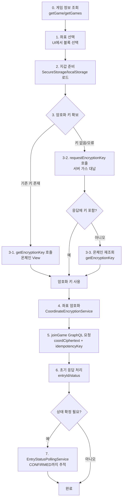

# Blockpick 게임 참가 & 암호화 키 통합 가이드

> 최종 업데이트: 2025-11-07
> 대상: 클라이언트 · 백엔드 · 블록체인 담당자 공통 레퍼런스

---

## 1. 개요

- 게임판에서 좌표(픽)를 선택해 참가 요청을 보낼 때 수행되는 전 과정을 정리한 단일 문서입니다.
- `docs/암호화_키_조회_하이브리드_방식.md`와 기존 `docs/게임_참가_프로세스.md` 내용을 통합했습니다.
- 하이브리드 암호화 키 전략(온체인 조회 우선 + 서버 가스 대납 생성)을 기준으로 최신 플로우를 설명합니다.

---

## 2. 핵심 설계 원칙

- **클라이언트 측 암호화**: 좌표 원본은 앱 밖으로 노출되지 않으며, 서버는 암호문만 저장합니다.
- **가스비 대납**: 사용자는 가스를 보유할 필요가 없고, 서버 지갑이 `requestEncryptionKey` 트랜잭션을 실행합니다.
- **소유권 분리**: 트랜잭션 발신자(msg.sender)는 서버 지갑, 키 소유자는 사용자 지갑 주소입니다.
- **하이브리드 키 획득**: 1차 시도는 온체인 View 조회(`getEncryptionKey`), 실패 시 서버가 키를 생성합니다.
- **익명성 확보**: `signerWallet`은 해시 후 전송하며, 백엔드 DB에는 암호문과 메타데이터만 저장합니다.

---

## 3. 하이브리드 암호화 키 전략

### 3.1 userIndex 규칙

- `userIndex = "${walletAddress.toLowerCase()}-$gameId"`
- 게임당 하나의 인덱스를 고정으로 사용해 중복 생성과 가스 낭비를 방지합니다.

### 3.2 단계별 흐름

```
┌─────────────────────────────────────────────────────────┐
│ [Step 1] 온체인 조회 (뷰 함수)                          │
│   SmartContractService.getEncryptionKey()               │
│   - 성공: 기존 키 즉시 재사용 → 서버 호출 없음          │
│   - 실패: 키 미존재 / 권한 오류 / RPC 오류              │
└───────────┬─────────────────────────────────────────────┘
            │ (예외 발생 시)
            ▼
┌─────────────────────────────────────────────────────────┐
│ [Step 2] 서버 가스 대납 생성                            │
│   GraphQL requestEncryptionKey                          │
│   - 서버 지갑이 requestEncryptionKey 트랜잭션 실행      │
│   - 성공 시: 응답에 키 포함 또는 온체인 저장            │
│   - 실패 시: code, message로 상세 전달                  │
└───────────┬─────────────────────────────────────────────┘
            │
            ▼
┌─────────────────────────────────────────────────────────┐
│ [Step 3] 후속 조회                                      │
│   - 응답에 키가 없으면 온체인 view로 재확인             │
│   - 실패 연속 시 오류로 종료                            │
└─────────────────────────────────────────────────────────┘
```

### 3.3 폴링 정책

- `EncryptionKeyPollingService`가 준비되어 있으며, 서버가 `requestId`를 내려주면 상태 폴링을 적용할 수 있습니다.
- 현재 앱 구현에서는 **키 생성 단계에 폴링을 적용하지 않고**, 실패 응답을 받으면 즉시 에러를 표시합니다.
  향후 `requestId`를 포함하도록 API를 확장하고 폴링을 활성화하는 방안을 검토합니다.

---

## 4. 참가 프로세스 요약 (End-to-End)

| 단계 | 주체 | 설명 | 주요 산출물 |
| --- | --- | --- | --- |
| 0 | 클라이언트 | `getGame`/`getGames`로 메타데이터 로드 | `onchainContractAddr`, `gridRows/Cols` |
| 1 | 클라이언트 | 게임판에서 좌표 선택, UI 표시 | `selectedCell(row,col)` |
| 2 | 클라이언트 | 지갑 로드/생성 (`BlockchainWalletService`) | `walletAddress`, `credentials` |
| 3 | 클라이언트 | 하이브리드 방식으로 암호화 키 확보 | `encryptionKey` |
| 4 | 클라이언트 | 좌표 암호화 (`CoordinateEncryptionService`) | `coordCiphertext` |
| 5 | 클라이언트 | `joinGame` GraphQL 호출 (idempotency 포함) | `entryId`, 초기 `status` |
| 6 | 서버 | 참가 정보 저장, Outbox 이벤트 발행 | DB row, Outbox 이벤트 |
| 7 | 클라이언트 | (선택) `EntryStatusPollingService`로 확정 여부 확인 | 최종 `status`, `txHash` |

### 4.1 단계별 상세 플로우

```
┌──────────────────────────────────────────┐
│ 0. 게임 정보 조회                         │
│    - GraphQL `getGame`/`getGames` 호출    │
│    - 컨트랙트 주소 · 그리드 정보 확보     │
└──────────┬───────────────────────────────┘
           │
           ▼
┌──────────────────────────────────────────┐
│ 1. 좌표 선택                              │
│    - 사용자가 게임판에서 블록 선택        │
│    - UI에 선택 좌표 표시                  │
└──────────┬───────────────────────────────┘
           │
           ▼
┌──────────────────────────────────────────┐
│ 2. 지갑 준비                              │
│    - SecureStorage/localStorage에서 로드  │
│    - 없으면 자동 생성                     │
│    - 주소(lowercase) 확보                 │
└──────────┬───────────────────────────────┘
           │
           ▼
┌──────────────────────────────────────────┐
│ 3. 암호화 키 확보 (하이브리드)            │
│    3-1. View 함수 호출 → 기존 키 조회     │
│         ✓ 성공 시 바로 사용               │
│    3-2. (실패 시) GraphQL로 서버 생성 요청│
│         ✓ 성공 시 응답 or 온체인 저장     │
│    3-3. (응답에 키 없음) 온체인 재조회    │
└──────────┬───────────────────────────────┘
           │
           ▼
┌──────────────────────────────────────────┐
│ 4. 좌표 암호화                            │
│    - `CoordinateEncryptionService` 사용   │
│    - 암호문(coordCiphertext) 생성        │
└──────────┬───────────────────────────────┘
           │
           ▼
┌──────────────────────────────────────────┐
│ 5. joinGame 요청                          │
│    - 암호문, idempotencyKey, signer 해시  │
│      를 담아 GraphQL `joinGame` 호출      │
│    - 서버는 DB 저장 · Outbox 발행         │
└──────────┬───────────────────────────────┘
           │
           ▼
┌──────────────────────────────────────────┐
│ 6. 초기 응답 처리                         │
│    - `success`, `entryId`, 초기 `status`  │
│    - 실패 시 사용자에게 에러 노출         │
└──────────┬───────────────────────────────┘
           │
           ▼
┌──────────────────────────────────────────┐
│ 7. 상태 폴링 (선택)                       │
│    - `EntryStatusPollingService` 사용     │
│    - 트랜잭션 확정 여부 추적              │
│    - 최종 상태(예: `CONFIRMED`) 업데이트  │
└──────────────────────────────────────────┘
```

### 4.2 Mermaid 플로우차트



### 4.3 인터랙션 채널 요약

| 단계 | 명령/채널 | 타입 | 폴링 | 설명 |
| --- | --- | --- | --- | --- |
| 0 | GraphQL `getGame`, `getGames` | **Query** | ✖ | 게임/컨트랙트 메타데이터 조회 |
| 1 | 로컬 UI 이벤트 | - | ✖ | 사용자 입력(좌표 선택) |
| 2 | SecureStorage/localStorage | - | ✖ | 지갑 로드/생성 (클라이언트 로컬 처리) |
| 3-1 | `SmartContractService.getEncryptionKey` | **온체인 View** | ✖ | 기존 키 조회 (RPC) |
| 3-2 | GraphQL `requestEncryptionKey` | **Mutation** | ✖ (현재) | 서버가 트랜잭션 실행, 응답에 키/txHash 제공 |
| 3-3 | `SmartContractService.getEncryptionKey` | **온체인 View** | ✖ | 서버 응답에 키 없을 경우 재조회 |
| 3 (확장) | `EncryptionKeyPollingService.pollEncryptionKeyStatus` | **GraphQL Query** | ✔ (옵션) | 서버가 `requestId`를 제공할 때 폴링 |
| 4 | `CoordinateEncryptionService.encryptCoordinate` | - | ✖ | 암호문 생성 (클라이언트 로컬) |
| 5 | GraphQL `joinGame` | **Mutation** | ✖ | 암호문, idempotencyKey, signer 해시 전달 |
| 6 | GraphQL 응답 처리 | - | ✖ | `entryId`, 초기 `status` 수신 |
| 7 | `EntryStatusPollingService.pollEntryStatus` | **GraphQL Query** | ✔ | 엔트리 상태가 `CONFIRMED` 될 때까지 폴링 |

---

## 5. GraphQL 인터페이스

### 5.1 requestEncryptionKey

```graphql
mutation RequestEncryptionKey($input: RequestEncryptionKeyInput!) {
  requestEncryptionKey(input: $input) {
    success
    code
    message
    encryptionKey
    contractAddress
    txHash
    userAddress
    index
    requestId        # ❕ 폴링용 ID (확장 예정)
  }
}
```

- **Input**: `gameId`, `userAddress`, `index`(선택)
- **성공 시** 키 또는 트랜잭션 정보 반환.
- **실패 시** `success: false`, `code`, `message`로 이유 전달
  (예: `KEY_REQUEST_PROCESSING_FAILED`, `KEY_ALREADY_EXISTS`, `GAME_NOT_FOUND`)

### 5.2 joinGame

```graphql
mutation JoinGame($input: JoinGameInput!) {
  joinGame(input: $input) {
    success
    code
    message
    entryId
    status
    txHash
    errorCode
  }
}
```

- `signerWallet`는 **SHA-256 해시** 후 전달 (`walletHash.substring(0, 16)` 활용)
- `idempotencyKey = "$gameId-${walletHash.substring(0,16)}-$timestamp"`
  (중복 방지 및 재시도 대비)

---

## 6. 스마트 컨트랙트 (Polygon Amoy)

| 함수 | 유형 | 설명 |
| --- | --- | --- |
| `requestEncryptionKey(string _index, address _userAddress)` | state 변경 | 서버 지갑이 호출, 키 생성 이벤트 방출 |
| `getEncryptionKey(string _index, address _owner)` | view | 사용자 또는 공개 조건 충족 시 키 반환 |
| `storeEncryptedCoordinates(string _index, string _encryptedCoordinates)` | state 변경 | (옵션) 암호화 좌표 온체인 저장 |

**이벤트**

- `event EncryptionKeyGenerated(string indexed index, address indexed sender, string key);`
- `event EncryptedCoordinatesStored(string indexed index, address indexed sender);`

컨트랙트는 게임별로 개별 배포되며, GraphQL `game.onchainContractAddr` 필드로 주소를 전달합니다.

---

## 7. 데이터 & 보안 정책

- **백엔드 저장값**: `coordCiphertext`, `signerWalletHash`, `entryId`, `gameId`, `idempotencyKey`, 상태, 감사 로그.
- **노출 금지**: 원본 좌표, 개인키, 평문 지갑 주소.
- **클라이언트 스토리지**
  - 모바일: SecureStorage(Keychain / EncryptedSharedPreferences)
  - 웹: localStorage (시드 구문 백업 안내), 필요 시 암호화된 백업 API 제공
- **복호화 권한**: 게임 종료 후 공개 조건(지연 시간 경과, 최대 참가자 도달 등) 충족 시에만 온체인 키 조회 허용.

---

## 8. 에러 처리 & 재시도 전략

- **KEY_REQUEST_PROCESSING_FAILED**
  - Outbox 이벤트 경쟁, DB 동시성 이슈 가능성 → 서버 로그 조사 및 재처리 필요
  - 클라이언트는 사용자에게 실패 메시지 표시 후 재시도 옵션 제공

- **UnexpectedResponseStructureException(__typename)**
  - 실패 응답에도 `__typename`을 포함하도록 백엔드 수정하거나,
    클라이언트에서 실패 응답은 캐시에 저장하지 않도록 예외 처리

- **온체인 조회 실패**
  - 권한 오류(`Not the owner`), 공개 조건 미충족, RPC 장애
  - 처리: 서버 생성 단계로 전환하거나, 네트워크 오류 시 백오프 재시도

- **UI 오버플로우(RenderFlex overflow)**
  - 실패 메시지가 길어지는 경우 스크롤 컨테이너/`Flexible`로 감싸서 레이아웃 안정화

---

## 9. 테스트 시나리오

1. **첫 참가 (키 없음)**
   - Step 1 실패 → Step 2 서버 생성 → 응답에 키 포함 → 좌표 암호화 및 참가
   - 서버 Outbox와 Polygonscan에서 `EncryptionKeyGenerated` 이벤트 확인

2. **재참가 (같은 게임)**
   - Step 1에서 즉시 키 반환 → 서버 호출 없음 → 즉시 암호화 후 `joinGame`

3. **실패 케이스 재현**
   - 동일 사용자/게임으로 빠른 연속 요청 → Outbox 충돌 감지
   - 실패 응답 문구 및 UI 처리 확인

4. **엔트리 상태 폴링**
   - `joinGame` 성공 후 `EntryStatusPollingService`로 `CONFIRMED`까지 추적
   - 네트워크 오류 발생 시 재시도 로직 검증

---

## 10. 참고 파일 & 모듈

- `lib/providers/game_participation_provider.dart`
- `lib/services/smart_contract_service.dart`
- `lib/services/encryption_key_polling_service.dart`
- `lib/services/entry_status_polling_service.dart`
- `docs/POLLING_IMPLEMENTATION_SUMMARY.md`

---

## 11. 향후 개선 아이템

- `requestEncryptionKey` 응답에 `requestId` 표준화 및 클라이언트 폴링 도입
- 실패 시 자동 백오프 재시도 정책 정의
- 키 생성·참가 단계 각각에 대한 UX 로딩/에러 컴포넌트 리팩터링
- 서버 Outbox 처리 모니터링 대시보드 연동

---

> 이 문서를 최신 단일 소스로 유지하면서, 이전 개별 문서는 참조용으로 보관만 하고 업데이트는 여기서 수행합니다.

