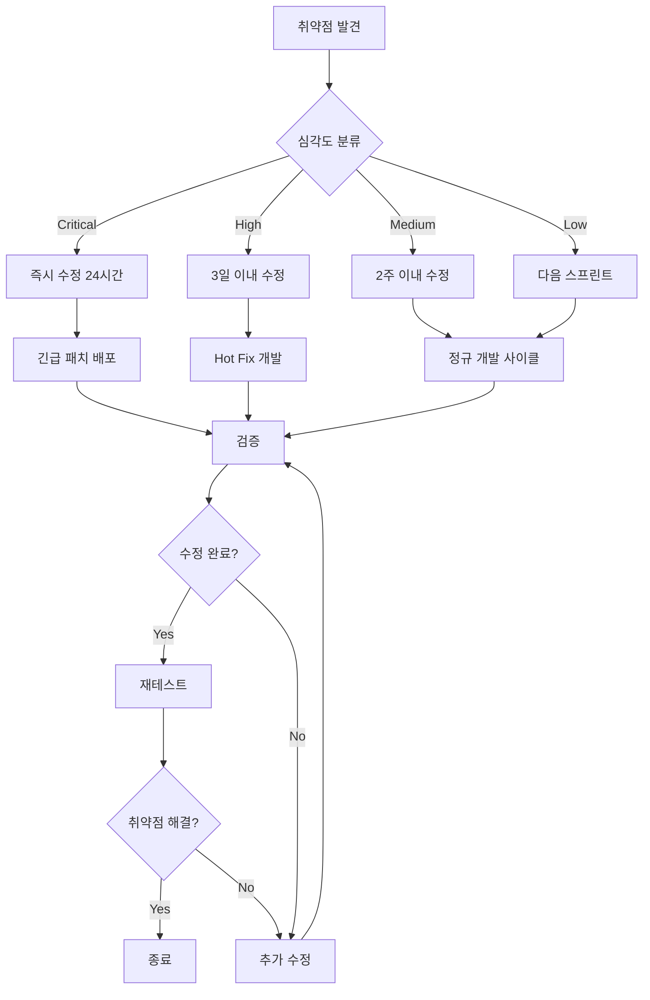
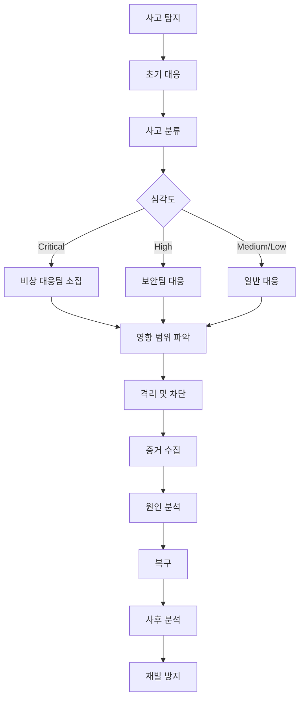

# 16. 보안정책서

## 문서 정보

| 항목 | 내용 |
|------|------|
| 문서명 | BlockPick 보안정책서 |
| 버전 | 1.0.0 |
| 작성일 | 2025-01-20 |
| 최종 수정일 | 2025-01-20 |
| 작성자 | BlockPick 보안팀 |
| 승인자 | CTO |
| 문서 분류 | 기밀 |

## 목차

1. [개요](#1-개요)
2. [보안 아키텍처](#2-보안-아키텍처)
3. [인증 및 권한 관리](#3-인증-및-권한-관리)
4. [데이터 보안](#4-데이터-보안)
5. [네트워크 보안](#5-네트워크-보안)
6. [애플리케이션 보안](#6-애플리케이션-보안)
7. [블록체인 보안](#7-블록체인-보안)
8. [인프라 보안](#8-인프라-보안)
9. [취약점 관리](#9-취약점-관리)
10. [침해사고 대응](#10-침해사고-대응)
11. [보안 모니터링](#11-보안-모니터링)
12. [규정 준수](#12-규정-준수)
13. [보안 교육](#13-보안-교육)
14. [부록](#14-부록)

---

## 1. 개요

### 1.1 문서 목적

본 문서는 BlockPick 플랫폼의 전반적인 보안 정책 및 절차를 정의한다.

**주요 목적:**
- 보안 정책 및 원칙 수립
- 보안 통제 방안 정의
- 침해사고 대응 절차 수립
- 규정 준수 요구사항 충족

### 1.2 적용 범위

**적용 대상:**
- BlockPick 모바일 애플리케이션
- GraphQL API 서버
- PostgreSQL 데이터베이스
- 스마트 컨트랙트
- AWS 인프라
- 외부 연동 시스템
- 모든 임직원 및 협력사

### 1.3 보안 목표

| 목표 | 설명 | 목표치 |
|------|------|---------|
| 기밀성 (Confidentiality) | 승인된 사용자만 정보 접근 | 99.9% |
| 무결성 (Integrity) | 데이터 정확성 및 완전성 보장 | 100% |
| 가용성 (Availability) | 서비스 지속적 제공 | 99.9% |
| 추적성 (Traceability) | 모든 활동 로그 기록 | 100% |
| 부인방지 (Non-repudiation) | 거래 부인 방지 | 100% |

### 1.4 보안 원칙

**1. 최소 권한 원칙 (Principle of Least Privilege)**
```
사용자 및 프로세스는 작업 수행에 필요한 최소한의 권한만 부여
```

**2. 심층 방어 (Defense in Depth)**
```
다층 보안 통제로 단일 실패 지점 제거
```

**3. 기본 보안 (Secure by Default)**
```
모든 설정은 기본적으로 가장 안전한 상태로 구성
```

**4. 실패 시 안전 (Fail Safe)**
```
시스템 실패 시 안전한 상태로 전환
```

**5. 완전한 중재 (Complete Mediation)**
```
모든 접근 요청에 대한 권한 검증
```

---

## 2. 보안 아키텍처

### 2.1 전체 보안 아키텍처

```
┌─────────────────────────────────────────────────────────────┐
│                      인터넷 영역                              │
│                                                               │
│  ┌──────────────┐      ┌──────────────┐                     │
│  │ Mobile App   │◄────►│   CloudFlare  │                     │
│  │  (Flutter)   │      │   WAF + CDN   │                     │
│  └──────────────┘      └───────┬───────┘                     │
│                                 │                             │
└─────────────────────────────────┼─────────────────────────────┘
                                  │ HTTPS (TLS 1.3)
┌─────────────────────────────────┼─────────────────────────────┐
│                      DMZ 영역    │                             │
│                                 ▼                             │
│                     ┌─────────────────┐                       │
│                     │   ALB           │                       │
│                     │  (AWS)          │                       │
│                     └────────┬────────┘                       │
│                              │                                │
│               ┌──────────────┼──────────────┐                │
│               │              │              │                │
│         ┌─────▼─────┐  ┌────▼─────┐  ┌────▼─────┐          │
│         │  API       │  │  API     │  │  API     │          │
│         │  Server 1  │  │ Server 2 │  │ Server 3 │          │
│         │  (ECS)     │  │  (ECS)   │  │  (ECS)   │          │
│         └─────┬──────┘  └────┬─────┘  └────┬─────┘          │
│               │              │              │                │
└───────────────┼──────────────┼──────────────┼────────────────┘
                │              │              │
┌───────────────┼──────────────┼──────────────┼────────────────┐
│  Private      │              │              │                │
│  Subnet       ▼              ▼              ▼                │
│         ┌──────────────────────────────────────┐             │
│         │      PostgreSQL RDS                  │             │
│         │      (Multi-AZ, Encrypted)           │             │
│         └──────────────────────────────────────┘             │
│                                                               │
│         ┌──────────────────────────────────────┐             │
│         │      Redis ElastiCache               │             │
│         │      (Encryption at rest/transit)    │             │
│         └──────────────────────────────────────┘             │
│                                                               │
│         ┌──────────────────────────────────────┐             │
│         │      S3 Buckets                      │             │
│         │      (Server-side encryption)        │             │
│         └──────────────────────────────────────┘             │
└───────────────────────────────────────────────────────────────┘

┌───────────────────────────────────────────────────────────────┐
│                    Blockchain Network                         │
│                                                               │
│         ┌──────────────────────────────────────┐             │
│         │   Polygon Mainnet                    │             │
│         │   (Smart Contracts)                  │             │
│         └──────────────────────────────────────┘             │
└───────────────────────────────────────────────────────────────┘
```

### 2.2 보안 계층 구조

| 계층 | 보안 통제 | 설명 |
|------|-----------|------|
| 1. 물리 계층 | AWS 데이터센터 보안 | ISO 27001, SOC 2 인증 |
| 2. 네트워크 계층 | VPC, Security Group, NACL | 네트워크 격리 및 접근 통제 |
| 3. 플랫폼 계층 | WAF, DDoS 방어, IDS/IPS | 악성 트래픽 차단 |
| 4. 애플리케이션 계층 | 인증/인가, 입력 검증, OWASP | 애플리케이션 보안 |
| 5. 데이터 계층 | 암호화, 마스킹, 백업 | 데이터 보호 |
| 6. 사용자 계층 | MFA, 세션 관리, 비밀번호 정책 | 사용자 인증 강화 |

### 2.3 신뢰 경계

**외부 신뢰 경계:**
```
인터넷 ─┬─> CloudFlare WAF ─> ALB ─> API Server
        │
        └─> Polygon Network ─> Smart Contract
```

**내부 신뢰 경계:**
```
API Server ─┬─> RDS (TLS)
            ├─> Redis (TLS)
            ├─> S3 (HTTPS)
            └─> External APIs (HTTPS)
```

**보안 검증 지점:**
1. CloudFlare WAF: SQL Injection, XSS 차단
2. ALB: SSL/TLS 종료, DDoS 방어
3. API Server: JWT 검증, Rate Limiting
4. Database: SQL 파라미터화, 권한 검증

---

## 3. 인증 및 권한 관리

### 3.1 사용자 인증

#### 3.1.1 인증 방식

**1. JWT 기반 인증**

```typescript
// JWT 토큰 구조
interface JWTPayload {
  sub: string;        // 사용자 ID
  email: string;      // 이메일
  role: UserRole;     // 역할
  iat: number;        // 발급 시간
  exp: number;        // 만료 시간
  jti: string;        // JWT ID (토큰 무효화용)
}

// 토큰 생성
function generateTokens(user: User): Tokens {
  const accessToken = jwt.sign(
    {
      sub: user.id,
      email: user.email,
      role: user.role,
      jti: uuidv4(),
    },
    process.env.JWT_SECRET,
    {
      expiresIn: '15m',      // Access Token: 15분
      algorithm: 'HS256',
    }
  );

  const refreshToken = jwt.sign(
    {
      sub: user.id,
      jti: uuidv4(),
    },
    process.env.REFRESH_SECRET,
    {
      expiresIn: '30d',      // Refresh Token: 30일
      algorithm: 'HS256',
    }
  );

  return { accessToken, refreshToken };
}

// 토큰 검증
function verifyToken(token: string): JWTPayload {
  try {
    return jwt.verify(token, process.env.JWT_SECRET) as JWTPayload;
  } catch (error) {
    if (error instanceof jwt.TokenExpiredError) {
      throw new AuthenticationError('토큰이 만료되었습니다');
    }
    throw new AuthenticationError('유효하지 않은 토큰입니다');
  }
}
```

**2. 비밀번호 정책**

| 항목 | 요구사항 |
|------|----------|
| 최소 길이 | 8자 이상 |
| 복잡도 | 영문 대소문자, 숫자, 특수문자 중 3종 이상 조합 |
| 재사용 금지 | 최근 3개 비밀번호 재사용 불가 |
| 만료 기간 | 90일 |
| 잠금 정책 | 5회 실패 시 30분 계정 잠금 |
| 해싱 알고리즘 | bcrypt (cost factor: 12) |

**구현:**

```typescript
import bcrypt from 'bcrypt';

// 비밀번호 해싱
async function hashPassword(password: string): Promise<string> {
  const saltRounds = 12;
  return bcrypt.hash(password, saltRounds);
}

// 비밀번호 검증
async function verifyPassword(
  password: string,
  hash: string
): Promise<boolean> {
  return bcrypt.compare(password, hash);
}

// 비밀번호 복잡도 검증
function validatePasswordComplexity(password: string): boolean {
  const requirements = [
    /[a-z]/.test(password),           // 소문자
    /[A-Z]/.test(password),           // 대문자
    /[0-9]/.test(password),           // 숫자
    /[!@#$%^&*(),.?":{}|<>]/.test(password), // 특수문자
  ];

  const metRequirements = requirements.filter(Boolean).length;
  return password.length >= 8 && metRequirements >= 3;
}

// 로그인 시도 추적
class LoginAttemptTracker {
  private attempts: Map<string, number> = new Map();
  private lockouts: Map<string, Date> = new Map();

  async recordAttempt(email: string): Promise<void> {
    const currentAttempts = this.attempts.get(email) || 0;
    this.attempts.set(email, currentAttempts + 1);

    if (currentAttempts + 1 >= 5) {
      const lockoutUntil = new Date(Date.now() + 30 * 60 * 1000); // 30분
      this.lockouts.set(email, lockoutUntil);

      // 로그 기록
      await auditLog.create({
        action: 'ACCOUNT_LOCKED',
        email,
        reason: 'Too many failed login attempts',
        lockedUntil: lockoutUntil,
      });
    }
  }

  isLocked(email: string): boolean {
    const lockoutUntil = this.lockouts.get(email);
    if (!lockoutUntil) return false;

    if (new Date() > lockoutUntil) {
      this.lockouts.delete(email);
      this.attempts.delete(email);
      return false;
    }

    return true;
  }

  resetAttempts(email: string): void {
    this.attempts.delete(email);
    this.lockouts.delete(email);
  }
}
```

#### 3.1.2 소셜 로그인 보안

**Google OAuth 2.0 구현:**

```typescript
import { OAuth2Client } from 'google-auth-library';

class GoogleAuthService {
  private client: OAuth2Client;

  constructor() {
    this.client = new OAuth2Client(
      process.env.GOOGLE_CLIENT_ID,
      process.env.GOOGLE_CLIENT_SECRET,
      process.env.GOOGLE_REDIRECT_URI
    );
  }

  async verifyIdToken(idToken: string): Promise<GoogleUser> {
    try {
      const ticket = await this.client.verifyIdToken({
        idToken,
        audience: process.env.GOOGLE_CLIENT_ID,
      });

      const payload = ticket.getPayload();

      if (!payload) {
        throw new Error('Invalid token payload');
      }

      // 토큰 발급자 검증
      if (payload.iss !== 'accounts.google.com' &&
          payload.iss !== 'https://accounts.google.com') {
        throw new Error('Invalid token issuer');
      }

      // 토큰 만료 시간 검증
      if (payload.exp && payload.exp < Date.now() / 1000) {
        throw new Error('Token expired');
      }

      return {
        id: payload.sub,
        email: payload.email,
        verified: payload.email_verified,
        name: payload.name,
        picture: payload.picture,
      };
    } catch (error) {
      throw new AuthenticationError('Google 인증 실패');
    }
  }
}
```

**Apple Sign In 구현:**

```typescript
import jwt from 'jsonwebtoken';
import jwksClient from 'jwks-rsa';

class AppleAuthService {
  private client: jwksClient.JwksClient;

  constructor() {
    this.client = jwksClient({
      jwksUri: 'https://appleid.apple.com/auth/keys',
      cache: true,
      cacheMaxAge: 86400000, // 24시간
    });
  }

  async verifyIdToken(idToken: string): Promise<AppleUser> {
    try {
      // JWT 헤더에서 kid 추출
      const decodedToken = jwt.decode(idToken, { complete: true });
      if (!decodedToken || !decodedToken.header.kid) {
        throw new Error('Invalid token format');
      }

      // 공개 키 가져오기
      const key = await this.client.getSigningKey(decodedToken.header.kid);
      const publicKey = key.getPublicKey();

      // 토큰 검증
      const payload = jwt.verify(idToken, publicKey, {
        issuer: 'https://appleid.apple.com',
        audience: process.env.APPLE_CLIENT_ID,
        algorithms: ['RS256'],
      }) as AppleJWTPayload;

      return {
        id: payload.sub,
        email: payload.email,
        verified: payload.email_verified === 'true',
      };
    } catch (error) {
      throw new AuthenticationError('Apple 인증 실패');
    }
  }
}
```

### 3.2 권한 관리

#### 3.2.1 역할 기반 접근 제어 (RBAC)

**역할 정의:**

```typescript
enum UserRole {
  USER = 'USER',              // 일반 사용자
  ADMIN = 'ADMIN',            // 관리자
  SUPER_ADMIN = 'SUPER_ADMIN', // 최고 관리자
  CS_AGENT = 'CS_AGENT',      // 고객 지원
  AUDITOR = 'AUDITOR',        // 감사자 (읽기 전용)
}

// 권한 매트릭스
const PERMISSIONS = {
  // 사용자 관리
  'user.read': [UserRole.USER, UserRole.ADMIN, UserRole.SUPER_ADMIN, UserRole.CS_AGENT, UserRole.AUDITOR],
  'user.update': [UserRole.USER],
  'user.delete': [UserRole.USER],
  'user.manage': [UserRole.ADMIN, UserRole.SUPER_ADMIN],

  // 게임 관리
  'game.read': [UserRole.USER, UserRole.ADMIN, UserRole.SUPER_ADMIN, UserRole.AUDITOR],
  'game.join': [UserRole.USER],
  'game.create': [UserRole.ADMIN, UserRole.SUPER_ADMIN],
  'game.update': [UserRole.ADMIN, UserRole.SUPER_ADMIN],
  'game.delete': [UserRole.SUPER_ADMIN],
  'game.approve': [UserRole.ADMIN, UserRole.SUPER_ADMIN],

  // 상품 관리
  'product.read': [UserRole.USER, UserRole.ADMIN, UserRole.SUPER_ADMIN, UserRole.AUDITOR],
  'product.create': [UserRole.ADMIN, UserRole.SUPER_ADMIN],
  'product.update': [UserRole.ADMIN, UserRole.SUPER_ADMIN],
  'product.delete': [UserRole.SUPER_ADMIN],

  // 주문 관리
  'order.read': [UserRole.USER, UserRole.ADMIN, UserRole.SUPER_ADMIN, UserRole.CS_AGENT, UserRole.AUDITOR],
  'order.create': [UserRole.USER],
  'order.update': [UserRole.ADMIN, UserRole.SUPER_ADMIN, UserRole.CS_AGENT],
  'order.cancel': [UserRole.USER, UserRole.ADMIN, UserRole.SUPER_ADMIN],

  // 캐시 관리
  'cash.read': [UserRole.USER, UserRole.ADMIN, UserRole.SUPER_ADMIN, UserRole.AUDITOR],
  'cash.grant': [UserRole.ADMIN, UserRole.SUPER_ADMIN],
  'cash.revoke': [UserRole.SUPER_ADMIN],

  // 시스템 관리
  'system.settings': [UserRole.SUPER_ADMIN],
  'system.logs': [UserRole.ADMIN, UserRole.SUPER_ADMIN, UserRole.AUDITOR],
  'system.audit': [UserRole.AUDITOR, UserRole.SUPER_ADMIN],
};

// 권한 검증 미들웨어
function requirePermission(permission: string) {
  return (req: Request, res: Response, next: NextFunction) => {
    const user = req.user; // JWT에서 추출된 사용자 정보

    if (!user) {
      throw new AuthenticationError('인증이 필요합니다');
    }

    const allowedRoles = PERMISSIONS[permission];
    if (!allowedRoles || !allowedRoles.includes(user.role)) {
      throw new AuthorizationError('권한이 없습니다');
    }

    next();
  };
}

// GraphQL 디렉티브
const authDirective = {
  AUTH: (next, source, args, context) => {
    if (!context.user) {
      throw new AuthenticationError('인증이 필요합니다');
    }
    return next();
  },

  PERMISSION: (permission: string) => (next, source, args, context) => {
    if (!context.user) {
      throw new AuthenticationError('인증이 필요합니다');
    }

    const allowedRoles = PERMISSIONS[permission];
    if (!allowedRoles || !allowedRoles.includes(context.user.role)) {
      throw new AuthorizationError(`${permission} 권한이 없습니다`);
    }

    return next();
  },
};
```

**GraphQL 스키마 적용:**

```graphql
directive @auth on FIELD_DEFINITION
directive @permission(requires: String!) on FIELD_DEFINITION

type Query {
  me: User @auth
  user(id: ID!): User @permission(requires: "user.read")
  users(first: Int, after: String): UserConnection @permission(requires: "user.manage")

  game(id: ID!): Game @auth
  games(filter: GameFilter): GameConnection @auth

  auditLogs(filter: AuditLogFilter): AuditLogConnection @permission(requires: "system.audit")
}

type Mutation {
  updateProfile(input: UpdateProfileInput!): UpdateProfilePayload @auth
  deleteAccount: DeleteAccountPayload @auth

  createGame(input: CreateGameInput!): CreateGamePayload @permission(requires: "game.create")
  updateGame(input: UpdateGameInput!): UpdateGamePayload @permission(requires: "game.update")

  grantCash(input: GrantCashInput!): GrantCashPayload @permission(requires: "cash.grant")
}
```

#### 3.2.2 리소스 기반 접근 제어

**소유권 검증:**

```typescript
// 소유자만 접근 가능한 리소스
class ResourceOwnershipGuard {
  async canAccess(userId: string, resourceType: string, resourceId: string): Promise<boolean> {
    switch (resourceType) {
      case 'game_participation':
        const participation = await db.gameParticipation.findUnique({
          where: { id: resourceId },
          select: { userId: true },
        });
        return participation?.userId === userId;

      case 'order':
        const order = await db.order.findUnique({
          where: { id: resourceId },
          select: { userId: true },
        });
        return order?.userId === userId;

      case 'delivery_address':
        const address = await db.deliveryAddress.findUnique({
          where: { id: resourceId },
          select: { userId: true },
        });
        return address?.userId === userId;

      default:
        return false;
    }
  }
}

// GraphQL 리졸버에서 사용
const resolvers = {
  Query: {
    gameParticipation: async (_, { id }, context) => {
      const guard = new ResourceOwnershipGuard();

      if (!await guard.canAccess(context.user.id, 'game_participation', id)) {
        throw new AuthorizationError('접근 권한이 없습니다');
      }

      return db.gameParticipation.findUnique({ where: { id } });
    },
  },
};
```

### 3.3 세션 관리

#### 3.3.1 세션 보안

```typescript
interface Session {
  id: string;
  userId: string;
  accessToken: string;
  refreshToken: string;
  deviceInfo: DeviceInfo;
  ipAddress: string;
  createdAt: Date;
  expiresAt: Date;
  lastActivityAt: Date;
}

class SessionManager {
  // Redis를 사용한 세션 저장
  async createSession(user: User, deviceInfo: DeviceInfo, ipAddress: string): Promise<Session> {
    const sessionId = uuidv4();
    const tokens = generateTokens(user);

    const session: Session = {
      id: sessionId,
      userId: user.id,
      accessToken: tokens.accessToken,
      refreshToken: tokens.refreshToken,
      deviceInfo,
      ipAddress,
      createdAt: new Date(),
      expiresAt: new Date(Date.now() + 30 * 24 * 60 * 60 * 1000), // 30일
      lastActivityAt: new Date(),
    };

    await redis.setex(
      `session:${sessionId}`,
      30 * 24 * 60 * 60, // 30일
      JSON.stringify(session)
    );

    // 사용자별 세션 목록 관리
    await redis.sadd(`user:${user.id}:sessions`, sessionId);

    return session;
  }

  // 세션 갱신
  async refreshSession(refreshToken: string): Promise<Tokens> {
    try {
      const payload = jwt.verify(refreshToken, process.env.REFRESH_SECRET) as JWTPayload;

      // 세션 조회
      const sessions = await redis.smembers(`user:${payload.sub}:sessions`);
      let validSession: Session | null = null;

      for (const sessionId of sessions) {
        const sessionData = await redis.get(`session:${sessionId}`);
        if (sessionData) {
          const session = JSON.parse(sessionData) as Session;
          if (session.refreshToken === refreshToken) {
            validSession = session;
            break;
          }
        }
      }

      if (!validSession) {
        throw new Error('유효하지 않은 세션입니다');
      }

      // 새 토큰 발급
      const user = await db.user.findUnique({ where: { id: payload.sub } });
      if (!user) {
        throw new Error('사용자를 찾을 수 없습니다');
      }

      const newTokens = generateTokens(user);

      // 세션 업데이트
      validSession.accessToken = newTokens.accessToken;
      validSession.refreshToken = newTokens.refreshToken;
      validSession.lastActivityAt = new Date();

      await redis.setex(
        `session:${validSession.id}`,
        30 * 24 * 60 * 60,
        JSON.stringify(validSession)
      );

      return newTokens;
    } catch (error) {
      throw new AuthenticationError('세션 갱신 실패');
    }
  }

  // 세션 무효화
  async revokeSession(sessionId: string): Promise<void> {
    const sessionData = await redis.get(`session:${sessionId}`);
    if (sessionData) {
      const session = JSON.parse(sessionData) as Session;
      await redis.del(`session:${sessionId}`);
      await redis.srem(`user:${session.userId}:sessions`, sessionId);

      // 감사 로그
      await auditLog.create({
        action: 'SESSION_REVOKED',
        userId: session.userId,
        sessionId,
      });
    }
  }

  // 모든 세션 무효화 (비밀번호 변경 시)
  async revokeAllSessions(userId: string): Promise<void> {
    const sessions = await redis.smembers(`user:${userId}:sessions`);

    for (const sessionId of sessions) {
      await redis.del(`session:${sessionId}`);
    }

    await redis.del(`user:${userId}:sessions`);

    await auditLog.create({
      action: 'ALL_SESSIONS_REVOKED',
      userId,
      reason: 'Password changed',
    });
  }

  // 비활성 세션 정리
  async cleanupInactiveSessions(): Promise<void> {
    const keys = await redis.keys('session:*');
    const now = Date.now();
    const inactivityThreshold = 7 * 24 * 60 * 60 * 1000; // 7일

    for (const key of keys) {
      const sessionData = await redis.get(key);
      if (sessionData) {
        const session = JSON.parse(sessionData) as Session;
        const inactiveDuration = now - new Date(session.lastActivityAt).getTime();

        if (inactiveDuration > inactivityThreshold) {
          await this.revokeSession(session.id);
        }
      }
    }
  }
}
```

#### 3.3.2 동시 세션 제한

```typescript
class ConcurrentSessionLimiter {
  private readonly maxSessions = 5; // 최대 5개 디바이스

  async checkAndEnforce(userId: string): Promise<void> {
    const sessions = await redis.smembers(`user:${userId}:sessions`);

    if (sessions.length >= this.maxSessions) {
      // 가장 오래된 세션 찾기
      let oldestSession: Session | null = null;
      let oldestTime = Date.now();

      for (const sessionId of sessions) {
        const sessionData = await redis.get(`session:${sessionId}`);
        if (sessionData) {
          const session = JSON.parse(sessionData) as Session;
          const lastActivity = new Date(session.lastActivityAt).getTime();

          if (lastActivity < oldestTime) {
            oldestTime = lastActivity;
            oldestSession = session;
          }
        }
      }

      // 가장 오래된 세션 제거
      if (oldestSession) {
        const sessionManager = new SessionManager();
        await sessionManager.revokeSession(oldestSession.id);

        // 사용자에게 알림
        await notificationService.send({
          userId,
          type: 'SESSION_TERMINATED',
          message: '새로운 디바이스에서 로그인하여 이전 세션이 종료되었습니다.',
        });
      }
    }
  }
}
```

---

## 4. 데이터 보안

### 4.1 암호화

#### 4.1.1 전송 중 암호화 (Encryption in Transit)

**TLS 1.3 설정:**

```nginx
# Nginx 설정
server {
    listen 443 ssl http2;
    server_name api.blockpick.io;

    # TLS 1.3만 허용
    ssl_protocols TLSv1.3;

    # 강력한 암호화 스위트
    ssl_ciphers 'TLS_AES_256_GCM_SHA384:TLS_CHACHA20_POLY1305_SHA256:TLS_AES_128_GCM_SHA256';
    ssl_prefer_server_ciphers on;

    # 인증서
    ssl_certificate /etc/ssl/certs/blockpick.crt;
    ssl_certificate_key /etc/ssl/private/blockpick.key;

    # HSTS (HTTP Strict Transport Security)
    add_header Strict-Transport-Security "max-age=31536000; includeSubDomains; preload" always;

    # OCSP Stapling
    ssl_stapling on;
    ssl_stapling_verify on;
    ssl_trusted_certificate /etc/ssl/certs/ca-bundle.crt;

    # SSL 세션 캐시
    ssl_session_cache shared:SSL:10m;
    ssl_session_timeout 10m;
    ssl_session_tickets off;

    location / {
        proxy_pass http://backend;
        proxy_set_header X-Forwarded-Proto $scheme;
        proxy_set_header X-Forwarded-For $proxy_add_x_forwarded_for;
    }
}
```

**데이터베이스 연결 암호화:**

```typescript
// PostgreSQL SSL 연결
const pool = new Pool({
  host: process.env.DB_HOST,
  port: 5432,
  database: process.env.DB_NAME,
  user: process.env.DB_USER,
  password: process.env.DB_PASSWORD,
  ssl: {
    rejectUnauthorized: true,
    ca: fs.readFileSync('/path/to/ca-cert.pem').toString(),
    cert: fs.readFileSync('/path/to/client-cert.pem').toString(),
    key: fs.readFileSync('/path/to/client-key.pem').toString(),
  },
  max: 20,
  idleTimeoutMillis: 30000,
});
```

#### 4.1.2 저장 시 암호화 (Encryption at Rest)

**1. 데이터베이스 암호화**

```sql
-- PostgreSQL 투명 데이터 암호화 (TDE)
-- AWS RDS에서 자동 관리

-- 민감 컬럼 암호화 (Application-level)
CREATE OR REPLACE FUNCTION encrypt_sensitive_data(data TEXT)
RETURNS BYTEA AS $$
BEGIN
  RETURN pgp_sym_encrypt(data, current_setting('app.encryption_key'));
END;
$$ LANGUAGE plpgsql;

CREATE OR REPLACE FUNCTION decrypt_sensitive_data(encrypted BYTEA)
RETURNS TEXT AS $$
BEGIN
  RETURN pgp_sym_decrypt(encrypted, current_setting('app.encryption_key'));
END;
$$ LANGUAGE plpgsql;

-- 사용 예시
ALTER TABLE users ADD COLUMN phone_encrypted BYTEA;

-- 데이터 암호화하여 저장
UPDATE users
SET phone_encrypted = encrypt_sensitive_data(phone_number)
WHERE phone_number IS NOT NULL;
```

**2. 애플리케이션 레벨 암호화**

```typescript
import crypto from 'crypto';

class EncryptionService {
  private algorithm = 'aes-256-gcm';
  private keyLength = 32; // 256 bits
  private ivLength = 16;  // 128 bits
  private tagLength = 16; // 128 bits

  constructor(private masterKey: string) {
    // Master key는 AWS KMS에서 관리
  }

  encrypt(plaintext: string): string {
    // IV (Initialization Vector) 생성
    const iv = crypto.randomBytes(this.ivLength);

    // 암호화
    const cipher = crypto.createCipheriv(
      this.algorithm,
      Buffer.from(this.masterKey, 'hex'),
      iv
    );

    let encrypted = cipher.update(plaintext, 'utf8', 'hex');
    encrypted += cipher.final('hex');

    // 인증 태그
    const tag = cipher.getAuthTag();

    // IV + Tag + Encrypted Data
    return Buffer.concat([iv, tag, Buffer.from(encrypted, 'hex')]).toString('base64');
  }

  decrypt(ciphertext: string): string {
    const buffer = Buffer.from(ciphertext, 'base64');

    // IV, Tag, Encrypted Data 분리
    const iv = buffer.subarray(0, this.ivLength);
    const tag = buffer.subarray(this.ivLength, this.ivLength + this.tagLength);
    const encrypted = buffer.subarray(this.ivLength + this.tagLength);

    // 복호화
    const decipher = crypto.createDecipheriv(
      this.algorithm,
      Buffer.from(this.masterKey, 'hex'),
      iv
    );

    decipher.setAuthTag(tag);

    let decrypted = decipher.update(encrypted.toString('hex'), 'hex', 'utf8');
    decrypted += decipher.final('utf8');

    return decrypted;
  }

  // 해시 (단방향)
  hash(data: string): string {
    return crypto.createHash('sha256').update(data).digest('hex');
  }

  // HMAC (메시지 인증 코드)
  hmac(data: string, secret: string): string {
    return crypto.createHmac('sha256', secret).update(data).digest('hex');
  }
}

// 사용 예시
const encryptionService = new EncryptionService(process.env.MASTER_KEY);

// 개인정보 암호화
const encryptedPhone = encryptionService.encrypt('010-1234-5678');
const encryptedSSN = encryptionService.encrypt('901201-1234567');

// 저장
await db.user.update({
  where: { id: userId },
  data: {
    phoneEncrypted: encryptedPhone,
    ssnEncrypted: encryptedSSN,
  },
});

// 복호화
const user = await db.user.findUnique({ where: { id: userId } });
const phone = encryptionService.decrypt(user.phoneEncrypted);
```

**3. AWS KMS를 사용한 키 관리**

```typescript
import { KMSClient, EncryptCommand, DecryptCommand, GenerateDataKeyCommand } from '@aws-sdk/client-kms';

class KMSEncryptionService {
  private client: KMSClient;
  private keyId: string;

  constructor() {
    this.client = new KMSClient({ region: 'ap-northeast-2' });
    this.keyId = process.env.KMS_KEY_ID;
  }

  async encrypt(plaintext: string): Promise<string> {
    const command = new EncryptCommand({
      KeyId: this.keyId,
      Plaintext: Buffer.from(plaintext),
    });

    const response = await this.client.send(command);
    return Buffer.from(response.CiphertextBlob).toString('base64');
  }

  async decrypt(ciphertext: string): Promise<string> {
    const command = new DecryptCommand({
      CiphertextBlob: Buffer.from(ciphertext, 'base64'),
    });

    const response = await this.client.send(command);
    return Buffer.from(response.Plaintext).toString('utf8');
  }

  // 데이터 키 생성 (Envelope Encryption)
  async generateDataKey(): Promise<{ plaintextKey: string; encryptedKey: string }> {
    const command = new GenerateDataKeyCommand({
      KeyId: this.keyId,
      KeySpec: 'AES_256',
    });

    const response = await this.client.send(command);

    return {
      plaintextKey: Buffer.from(response.Plaintext).toString('hex'),
      encryptedKey: Buffer.from(response.CiphertextBlob).toString('base64'),
    };
  }
}
```

**4. S3 버킷 암호화**

```typescript
import { S3Client, PutObjectCommand } from '@aws-sdk/client-s3';

class S3Service {
  private client: S3Client;
  private bucket: string;

  constructor() {
    this.client = new S3Client({ region: 'ap-northeast-2' });
    this.bucket = process.env.S3_BUCKET;
  }

  async uploadFile(key: string, body: Buffer, contentType: string): Promise<string> {
    const command = new PutObjectCommand({
      Bucket: this.bucket,
      Key: key,
      Body: body,
      ContentType: contentType,
      // 서버 측 암호화 (SSE-KMS)
      ServerSideEncryption: 'aws:kms',
      SSEKMSKeyId: process.env.KMS_KEY_ID,
      // 메타데이터 암호화
      Metadata: {
        'x-amz-server-side-encryption': 'aws:kms',
      },
    });

    await this.client.send(command);

    return `https://${this.bucket}.s3.ap-northeast-2.amazonaws.com/${key}`;
  }
}
```

### 4.2 개인정보 보호

#### 4.2.1 개인정보 분류

| 등급 | 설명 | 예시 | 보호 수준 |
|------|------|------|-----------|
| 1등급 | 고유 식별 정보 | 주민등록번호, 여권번호 | 암호화 + 접근 로그 |
| 2등급 | 민감 개인정보 | 전화번호, 주소, 생년월일 | 암호화 |
| 3등급 | 일반 개인정보 | 이름, 이메일 | 접근 제어 |
| 4등급 | 공개 정보 | 닉네임, 프로필 이미지 | 무결성 검증 |

#### 4.2.2 데이터 마스킹

```typescript
class DataMaskingService {
  // 전화번호 마스킹: 010-1234-5678 -> 010-****-5678
  maskPhoneNumber(phone: string): string {
    return phone.replace(/(\d{3})-(\d{4})-(\d{4})/, '$1-****-$3');
  }

  // 이메일 마스킹: user@example.com -> u***@example.com
  maskEmail(email: string): string {
    const [username, domain] = email.split('@');
    const masked = username[0] + '***';
    return `${masked}@${domain}`;
  }

  // 이름 마스킹: 홍길동 -> 홍*동
  maskName(name: string): string {
    if (name.length === 2) {
      return name[0] + '*';
    }
    return name[0] + '*'.repeat(name.length - 2) + name[name.length - 1];
  }

  // 주소 마스킹: 서울시 강남구 테헤란로 123 -> 서울시 강남구 ***
  maskAddress(address: string): string {
    const parts = address.split(' ');
    if (parts.length <= 2) return address;
    return parts.slice(0, 2).join(' ') + ' ***';
  }

  // 카드 번호 마스킹: 1234-5678-9012-3456 -> 1234-****-****-3456
  maskCardNumber(cardNumber: string): string {
    return cardNumber.replace(/(\d{4})-(\d{4})-(\d{4})-(\d{4})/, '$1-****-****-$4');
  }
}

// GraphQL 리졸버에서 사용
const resolvers = {
  User: {
    phone: (user, _, context) => {
      const maskingService = new DataMaskingService();

      // 본인이거나 관리자인 경우에만 전체 번호 반환
      if (context.user.id === user.id || context.user.role === 'ADMIN') {
        return user.phone;
      }

      return maskingService.maskPhoneNumber(user.phone);
    },

    email: (user, _, context) => {
      const maskingService = new DataMaskingService();

      if (context.user.id === user.id || context.user.role === 'ADMIN') {
        return user.email;
      }

      return maskingService.maskEmail(user.email);
    },
  },
};
```

#### 4.2.3 개인정보 보유 및 파기

```typescript
class PersonalDataRetentionService {
  // 휴면 계정 처리 (1년 미접속)
  async handleDormantAccounts(): Promise<void> {
    const oneYearAgo = new Date();
    oneYearAgo.setFullYear(oneYearAgo.getFullYear() - 1);

    const dormantUsers = await db.user.findMany({
      where: {
        lastLoginAt: {
          lt: oneYearAgo,
        },
        status: 'ACTIVE',
      },
    });

    for (const user of dormantUsers) {
      // 1. 개인정보 분리 저장
      await db.dormantUser.create({
        data: {
          userId: user.id,
          email: user.email,
          encryptedData: this.encryptUserData(user),
          dormantAt: new Date(),
        },
      });

      // 2. 원본 테이블에서 개인정보 삭제
      await db.user.update({
        where: { id: user.id },
        data: {
          email: `dormant_${user.id}@example.com`,
          phone: null,
          name: null,
          birthDate: null,
          status: 'DORMANT',
        },
      });

      // 3. 사용자에게 이메일 알림
      await emailService.send({
        to: user.email,
        subject: '휴면 계정 전환 안내',
        body: '1년간 미접속으로 휴면 계정으로 전환되었습니다.',
      });

      // 4. 감사 로그
      await auditLog.create({
        action: 'USER_DORMANT',
        userId: user.id,
        details: {
          lastLoginAt: user.lastLoginAt,
        },
      });
    }
  }

  // 회원 탈퇴 처리
  async deleteAccount(userId: string): Promise<void> {
    const user = await db.user.findUnique({ where: { id: userId } });
    if (!user) {
      throw new Error('사용자를 찾을 수 없습니다');
    }

    // 1. 진행 중인 거래 확인
    const pendingOrders = await db.order.count({
      where: {
        userId,
        status: {
          in: ['PENDING', 'PROCESSING', 'SHIPPED'],
        },
      },
    });

    if (pendingOrders > 0) {
      throw new Error('진행 중인 주문이 있어 탈퇴할 수 없습니다');
    }

    // 2. 보유 캐시 확인
    if (user.eventCash > 0 || user.shoppingCash > 0) {
      throw new Error('보유 캐시가 있어 탈퇴할 수 없습니다');
    }

    await db.$transaction(async (tx) => {
      // 3. 개인정보 즉시 삭제
      await tx.user.update({
        where: { id: userId },
        data: {
          email: `deleted_${userId}@example.com`,
          phone: null,
          name: null,
          birthDate: null,
          profileImage: null,
          status: 'DELETED',
          deletedAt: new Date(),
        },
      });

      // 4. 연관 데이터 익명화
      await tx.gameParticipation.updateMany({
        where: { userId },
        data: { userId: null },
      });

      await tx.order.updateMany({
        where: { userId },
        data: { userId: null },
      });

      // 5. 배송지 정보 삭제
      await tx.deliveryAddress.deleteMany({
        where: { userId },
      });

      // 6. 세션 모두 무효화
      const sessionManager = new SessionManager();
      await sessionManager.revokeAllSessions(userId);

      // 7. 감사 로그
      await tx.auditLog.create({
        data: {
          action: 'USER_DELETED',
          userId,
          timestamp: new Date(),
          details: {
            reason: 'User requested account deletion',
          },
        },
      });
    });

    // 8. 탈퇴 완료 이메일
    await emailService.send({
      to: user.email,
      subject: '회원 탈퇴 완료',
      body: '회원 탈퇴가 완료되었습니다. 개인정보는 즉시 삭제되었습니다.',
    });
  }

  // 자동 파기 (보존 기간 만료)
  async autoDeleteExpiredData(): Promise<void> {
    const fiveYearsAgo = new Date();
    fiveYearsAgo.setFullYear(fiveYearsAgo.getFullYear() - 5);

    // 5년 경과한 주문 데이터 파기
    await db.order.deleteMany({
      where: {
        status: 'DELIVERED',
        deliveredAt: {
          lt: fiveYearsAgo,
        },
      },
    });

    // 3년 경과한 휴면 계정 파기
    const threeYearsAgo = new Date();
    threeYearsAgo.setFullYear(threeYearsAgo.getFullYear() - 3);

    await db.dormantUser.deleteMany({
      where: {
        dormantAt: {
          lt: threeYearsAgo,
        },
      },
    });

    await auditLog.create({
      action: 'DATA_AUTO_DELETED',
      details: {
        deletedBefore: fiveYearsAgo,
      },
    });
  }

  private encryptUserData(user: any): string {
    const encryptionService = new EncryptionService(process.env.MASTER_KEY);
    return encryptionService.encrypt(JSON.stringify(user));
  }
}

// 스케줄러로 정기 실행
import cron from 'node-cron';

// 매일 새벽 2시 휴면 계정 처리
cron.schedule('0 2 * * *', async () => {
  const service = new PersonalDataRetentionService();
  await service.handleDormantAccounts();
});

// 매주 일요일 새벽 3시 자동 파기
cron.schedule('0 3 * * 0', async () => {
  const service = new PersonalDataRetentionService();
  await service.autoDeleteExpiredData();
});
```

### 4.3 데이터 백업 및 복구

#### 4.3.1 백업 정책

| 항목 | 정책 |
|------|------|
| 전체 백업 | 매주 일요일 오전 2시 |
| 증분 백업 | 매일 오전 2시 |
| 트랜잭션 로그 백업 | 매 시간 |
| 보관 기간 | 30일 |
| 백업 저장소 | AWS S3 (Cross-Region Replication) |
| 암호화 | AES-256 (SSE-KMS) |
| 복구 목표 시간 (RTO) | 4시간 |
| 복구 목표 시점 (RPO) | 1시간 |

**백업 스크립트:**

```bash
#!/bin/bash

# 환경 변수
BACKUP_DIR="/var/backups/postgresql"
DB_HOST="db.blockpick.io"
DB_NAME="blockpick"
DB_USER="backup_user"
S3_BUCKET="blockpick-backups"
TIMESTAMP=$(date +"%Y%m%d_%H%M%S")
BACKUP_FILE="backup_${TIMESTAMP}.sql.gz"

# 백업 디렉토리 생성
mkdir -p $BACKUP_DIR

# PostgreSQL 전체 백업
PGPASSWORD=$DB_PASSWORD pg_dump \
  -h $DB_HOST \
  -U $DB_USER \
  -d $DB_NAME \
  -F c \
  -b \
  -v \
  -f "${BACKUP_DIR}/${BACKUP_FILE}"

# 압축
gzip "${BACKUP_DIR}/${BACKUP_FILE}"

# KMS로 암호화하여 S3에 업로드
aws s3 cp \
  "${BACKUP_DIR}/${BACKUP_FILE}.gz" \
  "s3://${S3_BUCKET}/daily/${BACKUP_FILE}.gz" \
  --sse aws:kms \
  --sse-kms-key-id $KMS_KEY_ID \
  --storage-class STANDARD_IA

# 30일 이전 백업 삭제
find $BACKUP_DIR -name "backup_*.sql.gz" -mtime +30 -delete

# S3에서도 30일 이전 백업 삭제
aws s3 ls "s3://${S3_BUCKET}/daily/" | \
  grep "backup_" | \
  awk '{print $4}' | \
  while read file; do
    file_date=$(echo $file | grep -oP '\d{8}')
    days_old=$(( ($(date +%s) - $(date -d $file_date +%s)) / 86400 ))
    if [ $days_old -gt 30 ]; then
      aws s3 rm "s3://${S3_BUCKET}/daily/$file"
    fi
  done

# 백업 검증
if [ -f "${BACKUP_DIR}/${BACKUP_FILE}.gz" ]; then
  echo "Backup completed successfully: ${BACKUP_FILE}.gz"

  # Slack 알림
  curl -X POST \
    -H 'Content-type: application/json' \
    --data "{\"text\":\"✅ Database backup completed: ${BACKUP_FILE}.gz\"}" \
    $SLACK_WEBHOOK_URL
else
  echo "Backup failed!"

  # Slack 알림
  curl -X POST \
    -H 'Content-type: application/json' \
    --data "{\"text\":\"❌ Database backup failed!\"}" \
    $SLACK_WEBHOOK_URL

  exit 1
fi
```

#### 4.3.2 복구 절차

```bash
#!/bin/bash

# 복구 스크립트
BACKUP_FILE=$1
DB_HOST="db.blockpick.io"
DB_NAME="blockpick"
DB_USER="postgres"
S3_BUCKET="blockpick-backups"

# S3에서 백업 파일 다운로드
aws s3 cp \
  "s3://${S3_BUCKET}/daily/${BACKUP_FILE}" \
  "/tmp/${BACKUP_FILE}"

# 압축 해제
gunzip "/tmp/${BACKUP_FILE}"

# 복구 전 현재 DB 백업
PGPASSWORD=$DB_PASSWORD pg_dump \
  -h $DB_HOST \
  -U postgres \
  -d $DB_NAME \
  -F c \
  -f "/tmp/pre_restore_backup.sql"

# 기존 연결 종료
PGPASSWORD=$DB_PASSWORD psql \
  -h $DB_HOST \
  -U postgres \
  -d postgres \
  -c "SELECT pg_terminate_backend(pid) FROM pg_stat_activity WHERE datname = '$DB_NAME';"

# 데이터베이스 삭제 및 재생성
PGPASSWORD=$DB_PASSWORD psql \
  -h $DB_HOST \
  -U postgres \
  -d postgres \
  -c "DROP DATABASE IF EXISTS $DB_NAME;"

PGPASSWORD=$DB_PASSWORD psql \
  -h $DB_HOST \
  -U postgres \
  -d postgres \
  -c "CREATE DATABASE $DB_NAME;"

# 복구 실행
PGPASSWORD=$DB_PASSWORD pg_restore \
  -h $DB_HOST \
  -U postgres \
  -d $DB_NAME \
  -v \
  "/tmp/${BACKUP_FILE%.gz}"

# 복구 검증
PGPASSWORD=$DB_PASSWORD psql \
  -h $DB_HOST \
  -U postgres \
  -d $DB_NAME \
  -c "SELECT COUNT(*) FROM users;" \
  -c "SELECT COUNT(*) FROM games;" \
  -c "SELECT COUNT(*) FROM game_participations;"

echo "Database restore completed!"
```

---

## 5. 네트워크 보안

### 5.1 네트워크 아키텍처

```
                    Internet
                        │
                        ▼
┌─────────────────────────────────────────────┐
│              CloudFlare                     │
│          WAF + DDoS Protection              │
└────────────────┬────────────────────────────┘
                 │
                 ▼
┌─────────────────────────────────────────────┐
│           AWS VPC                           │
│     CIDR: 10.0.0.0/16                      │
│                                             │
│  ┌────────────────────────────────────┐   │
│  │  Public Subnet (10.0.1.0/24)       │   │
│  │                                     │   │
│  │  ┌───────────────┐                │   │
│  │  │  NAT Gateway   │                │   │
│  │  └───────────────┘                │   │
│  │  ┌───────────────┐                │   │
│  │  │  ALB           │                │   │
│  │  └───────┬───────┘                │   │
│  └──────────┼──────────────────────────┘   │
│             │                               │
│  ┌──────────┼──────────────────────────┐   │
│  │  Private Subnet (10.0.2.0/24)      │   │
│  │          │                           │   │
│  │    ┌─────▼──────┐                  │   │
│  │    │ ECS Cluster │                  │   │
│  │    │ (API Server) │                 │   │
│  │    └─────┬──────┘                  │   │
│  └──────────┼──────────────────────────┘   │
│             │                               │
│  ┌──────────┼──────────────────────────┐   │
│  │  Database Subnet (10.0.3.0/24)     │   │
│  │          │                           │   │
│  │    ┌─────▼──────┐                  │   │
│  │    │ RDS         │                  │   │
│  │    │ PostgreSQL  │                  │   │
│  │    └────────────┘                  │   │
│  │    ┌────────────┐                  │   │
│  │    │ ElastiCache │                 │   │
│  │    │ Redis       │                  │   │
│  │    └────────────┘                  │   │
│  └─────────────────────────────────────┘   │
└─────────────────────────────────────────────┘
```

### 5.2 보안 그룹 설정

**1. ALB 보안 그룹:**

```hcl
resource "aws_security_group" "alb" {
  name        = "blockpick-alb-sg"
  description = "Security group for ALB"
  vpc_id      = aws_vpc.main.id

  # HTTPS 인바운드
  ingress {
    from_port   = 443
    to_port     = 443
    protocol    = "tcp"
    cidr_blocks = ["0.0.0.0/0"]
    description = "HTTPS from Internet"
  }

  # HTTP는 HTTPS로 리다이렉트만 허용
  ingress {
    from_port   = 80
    to_port     = 80
    protocol    = "tcp"
    cidr_blocks = ["0.0.0.0/0"]
    description = "HTTP redirect to HTTPS"
  }

  # 아웃바운드
  egress {
    from_port   = 0
    to_port     = 0
    protocol    = "-1"
    cidr_blocks = ["0.0.0.0/0"]
  }

  tags = {
    Name = "blockpick-alb-sg"
  }
}
```

**2. ECS 보안 그룹:**

```hcl
resource "aws_security_group" "ecs" {
  name        = "blockpick-ecs-sg"
  description = "Security group for ECS tasks"
  vpc_id      = aws_vpc.main.id

  # ALB에서만 트래픽 허용
  ingress {
    from_port       = 4000
    to_port         = 4000
    protocol        = "tcp"
    security_groups = [aws_security_group.alb.id]
    description     = "GraphQL API from ALB"
  }

  # 아웃바운드 (외부 API 호출용)
  egress {
    from_port   = 443
    to_port     = 443
    protocol    = "tcp"
    cidr_blocks = ["0.0.0.0/0"]
    description = "HTTPS to Internet"
  }

  # DB 접근
  egress {
    from_port       = 5432
    to_port         = 5432
    protocol        = "tcp"
    security_groups = [aws_security_group.rds.id]
    description     = "PostgreSQL"
  }

  # Redis 접근
  egress {
    from_port       = 6379
    to_port         = 6379
    protocol        = "tcp"
    security_groups = [aws_security_group.redis.id]
    description     = "Redis"
  }

  tags = {
    Name = "blockpick-ecs-sg"
  }
}
```

**3. RDS 보안 그룹:**

```hcl
resource "aws_security_group" "rds" {
  name        = "blockpick-rds-sg"
  description = "Security group for RDS"
  vpc_id      = aws_vpc.main.id

  # ECS에서만 접근 허용
  ingress {
    from_port       = 5432
    to_port         = 5432
    protocol        = "tcp"
    security_groups = [aws_security_group.ecs.id]
    description     = "PostgreSQL from ECS"
  }

  # Bastion에서 접근 허용 (관리용)
  ingress {
    from_port       = 5432
    to_port         = 5432
    protocol        = "tcp"
    security_groups = [aws_security_group.bastion.id]
    description     = "PostgreSQL from Bastion"
  }

  tags = {
    Name = "blockpick-rds-sg"
  }
}
```

### 5.3 WAF 규칙

```typescript
// CloudFlare WAF 규칙 설정
const wafRules = [
  {
    name: 'SQL Injection Protection',
    expression: '(http.request.uri.query contains "union select") or ' +
                '(http.request.uri.query contains "drop table") or ' +
                '(http.request.body contains "union select")',
    action: 'block',
  },
  {
    name: 'XSS Protection',
    expression: '(http.request.uri.query contains "<script") or ' +
                '(http.request.body contains "<script")',
    action: 'block',
  },
  {
    name: 'Rate Limiting - API',
    expression: '(http.request.uri.path eq "/graphql")',
    action: 'ratelimit',
    ratelimit: {
      characteristics: ['ip.src'],
      period: 60,
      requests_per_period: 100,
      mitigation_timeout: 600,
    },
  },
  {
    name: 'Rate Limiting - Authentication',
    expression: '(http.request.uri.path eq "/graphql") and ' +
                '(http.request.body contains "login")',
    action: 'ratelimit',
    ratelimit: {
      characteristics: ['ip.src'],
      period: 300,
      requests_per_period: 5,
      mitigation_timeout: 1800,
    },
  },
  {
    name: 'Geo Blocking',
    expression: '(ip.geoip.country ne "KR")',
    action: 'challenge',
  },
  {
    name: 'User Agent Blocking',
    expression: '(http.user_agent contains "bot") or ' +
                '(http.user_agent contains "crawler") or ' +
                '(http.user_agent eq "")',
    action: 'block',
  },
];
```

### 5.4 DDoS 방어

**1. CloudFlare DDoS Protection:**

```yaml
# CloudFlare 설정
dns_records:
  - type: A
    name: api.blockpick.io
    content: 54.180.123.45  # ALB IP
    proxied: true  # CloudFlare 프록시 활성화
    ttl: 1  # Auto

security_settings:
  security_level: high
  challenge_passage: 30
  browser_integrity_check: true

  # DDoS 설정
  ddos_protection:
    mode: automatic
    sensitivity: high

  # Bot 관리
  bot_management:
    enabled: true
    fight_mode: false
    super_bot_fight_mode: true
```

**2. AWS Shield Advanced:**

```hcl
resource "aws_shield_protection" "alb" {
  name         = "blockpick-alb-protection"
  resource_arn = aws_lb.main.arn

  tags = {
    Name = "blockpick-alb-shield"
  }
}

# CloudWatch 알람
resource "aws_cloudwatch_metric_alarm" "ddos_attack" {
  alarm_name          = "ddos-attack-detected"
  comparison_operator = "GreaterThanThreshold"
  evaluation_periods  = "2"
  metric_name         = "DDoSDetected"
  namespace           = "AWS/DDoSProtection"
  period              = "60"
  statistic           = "Sum"
  threshold           = "1"
  alarm_description   = "DDoS attack detected"
  alarm_actions       = [aws_sns_topic.alerts.arn]

  dimensions = {
    ResourceArn = aws_lb.main.arn
  }
}
```

**3. Application-level Rate Limiting:**

```typescript
import { RateLimiterRedis } from 'rate-limiter-flexible';
import Redis from 'ioredis';

const redisClient = new Redis({
  host: process.env.REDIS_HOST,
  port: 6379,
  enableOfflineQueue: false,
});

// API 전체 Rate Limiter
const apiRateLimiter = new RateLimiterRedis({
  storeClient: redisClient,
  keyPrefix: 'rl:api',
  points: 100, // 요청 수
  duration: 60, // 60초
  blockDuration: 600, // 차단 시간: 10분
});

// 인증 Rate Limiter (더 엄격)
const authRateLimiter = new RateLimiterRedis({
  storeClient: redisClient,
  keyPrefix: 'rl:auth',
  points: 5,
  duration: 300, // 5분에 5회
  blockDuration: 1800, // 차단 시간: 30분
});

// GraphQL Rate Limiter (복잡도 기반)
const graphqlRateLimiter = new RateLimiterRedis({
  storeClient: redisClient,
  keyPrefix: 'rl:graphql',
  points: 1000, // 복잡도 점수
  duration: 60,
  blockDuration: 300,
});

// 미들웨어
async function rateLimitMiddleware(req: Request, res: Response, next: NextFunction) {
  const clientIp = req.ip;

  try {
    // API Rate Limiting
    await apiRateLimiter.consume(clientIp);

    // 인증 요청인 경우 추가 제한
    if (isAuthRequest(req)) {
      await authRateLimiter.consume(clientIp);
    }

    next();
  } catch (error) {
    if (error instanceof Error) {
      res.status(429).json({
        error: 'Too Many Requests',
        message: '요청 한도를 초과했습니다. 잠시 후 다시 시도해주세요.',
        retryAfter: error.msBeforeNext / 1000,
      });
    }
  }
}

// GraphQL 복잡도 계산
import { getComplexity, simpleEstimator } from 'graphql-query-complexity';

function graphqlComplexityPlugin() {
  return {
    async requestDidStart() {
      return {
        async didResolveOperation({ request, document, schema, context }) {
          const complexity = getComplexity({
            schema,
            operationName: request.operationName,
            query: document,
            variables: request.variables,
            estimators: [
              simpleEstimator({ defaultComplexity: 1 }),
            ],
          });

          // 복잡도 기반 Rate Limiting
          try {
            await graphqlRateLimiter.consume(context.clientIp, complexity);
          } catch (error) {
            throw new Error('Query complexity limit exceeded');
          }

          // 최대 복잡도 제한
          if (complexity > 500) {
            throw new Error(`Query is too complex: ${complexity}. Maximum allowed complexity: 500`);
          }

          context.queryComplexity = complexity;
        },
      };
    },
  };
}
```

---

## 6. 애플리케이션 보안

### 6.1 입력 검증

#### 6.1.1 GraphQL Input Validation

```typescript
import { z } from 'zod';

// Zod 스키마 정의
const emailSchema = z.string().email('유효한 이메일 주소를 입력해주세요');
const phoneSchema = z.string().regex(/^010-\d{4}-\d{4}$/, '유효한 전화번호 형식이 아닙니다');
const passwordSchema = z.string()
  .min(8, '비밀번호는 최소 8자 이상이어야 합니다')
  .regex(/^(?=.*[a-z])(?=.*[A-Z])(?=.*\d)(?=.*[@$!%*?&])[A-Za-z\d@$!%*?&]/,
         '비밀번호는 영문 대소문자, 숫자, 특수문자를 포함해야 합니다');

const nicknameSchema = z.string()
  .min(2, '닉네임은 최소 2자 이상이어야 합니다')
  .max(20, '닉네임은 최대 20자까지 가능합니다')
  .regex(/^[a-zA-Z0-9가-힣_]+$/, '닉네임은 영문, 숫자, 한글, 언더스코어만 사용 가능합니다');

// Input 타입 검증
const registerInputSchema = z.object({
  email: emailSchema,
  password: passwordSchema,
  nickname: nicknameSchema,
  phone: phoneSchema.optional(),
  termsAgreed: z.boolean().refine(val => val === true, '이용약관에 동의해야 합니다'),
  privacyAgreed: z.boolean().refine(val => val === true, '개인정보 처리방침에 동의해야 합니다'),
});

const joinGameInputSchema = z.object({
  gameId: z.string().uuid('유효한 게임 ID가 아닙니다'),
  selectedBlocks: z.array(
    z.object({
      x: z.number().int().min(0).max(99),
      y: z.number().int().min(0).max(99),
    })
  ).min(1, '최소 1개 이상의 블록을 선택해야 합니다')
    .max(100, '최대 100개까지 선택 가능합니다'),
  paymentMethod: z.enum(['EVENT_CASH', 'SHOPPING_CASH', 'TOSS_PAY']),
});

// Resolver에서 사용
const resolvers = {
  Mutation: {
    register: async (_, { input }, context) => {
      // 입력 검증
      try {
        const validatedInput = registerInputSchema.parse(input);
      } catch (error) {
        if (error instanceof z.ZodError) {
          throw new ValidationError(error.errors[0].message);
        }
        throw error;
      }

      // 비즈니스 로직...
    },

    joinGame: async (_, { input }, context) => {
      // 입력 검증
      const validatedInput = joinGameInputSchema.parse(input);

      // 추가 비즈니스 검증
      const game = await db.game.findUnique({ where: { id: validatedInput.gameId } });
      if (!game) {
        throw new NotFoundError('게임을 찾을 수 없습니다');
      }

      if (game.status !== 'ACTIVE') {
        throw new BusinessError('참여할 수 없는 게임입니다');
      }

      // 중복 좌표 검증
      const uniqueBlocks = new Set(
        validatedInput.selectedBlocks.map(b => `${b.x},${b.y}`)
      );
      if (uniqueBlocks.size !== validatedInput.selectedBlocks.length) {
        throw new ValidationError('중복된 좌표가 있습니다');
      }

      // 비즈니스 로직...
    },
  },
};
```

#### 6.1.2 XSS 방어

```typescript
import DOMPurify from 'isomorphic-dompurify';
import he from 'he';

class XSSProtection {
  // HTML 이스케이프
  escapeHtml(unsafe: string): string {
    return he.encode(unsafe, {
      useNamedReferences: true,
      decimal: false,
    });
  }

  // HTML 디코드
  decodeHtml(safe: string): string {
    return he.decode(safe);
  }

  // HTML 정제 (허용된 태그만)
  sanitizeHtml(dirty: string): string {
    return DOMPurify.sanitize(dirty, {
      ALLOWED_TAGS: ['b', 'i', 'em', 'strong', 'a', 'p', 'br'],
      ALLOWED_ATTR: ['href', 'title'],
      ALLOW_DATA_ATTR: false,
    });
  }

  // URL 검증
  isValidUrl(url: string): boolean {
    try {
      const parsed = new URL(url);
      return ['http:', 'https:'].includes(parsed.protocol);
    } catch {
      return false;
    }
  }

  // 안전한 리다이렉트
  safeRedirect(url: string, allowedDomains: string[]): string {
    if (!this.isValidUrl(url)) {
      throw new Error('Invalid URL');
    }

    const parsed = new URL(url);
    if (!allowedDomains.includes(parsed.hostname)) {
      throw new Error('Redirect to untrusted domain not allowed');
    }

    return url;
  }
}

// GraphQL 리졸버에서 사용
const xssProtection = new XSSProtection();

const resolvers = {
  Mutation: {
    updateProfile: async (_, { input }, context) => {
      const sanitizedInput = {
        ...input,
        nickname: xssProtection.escapeHtml(input.nickname),
        bio: xssProtection.sanitizeHtml(input.bio || ''),
      };

      return db.user.update({
        where: { id: context.user.id },
        data: sanitizedInput,
      });
    },

    createProduct: async (_, { input }, context) => {
      const sanitizedInput = {
        ...input,
        name: xssProtection.escapeHtml(input.name),
        description: xssProtection.sanitizeHtml(input.description),
      };

      return db.product.create({ data: sanitizedInput });
    },
  },
};
```

#### 6.1.3 SQL Injection 방어

```typescript
import { PrismaClient } from '@prisma/client';

const db = new PrismaClient();

// ❌ 잘못된 예시 - SQL Injection 취약
async function searchUsersBad(keyword: string) {
  // 절대 이렇게 하지 말 것!
  const users = await db.$queryRawUnsafe(`
    SELECT * FROM users WHERE name LIKE '%${keyword}%'
  `);
  return users;
}

// ✅ 올바른 예시 1 - Prisma ORM 사용
async function searchUsersGood1(keyword: string) {
  const users = await db.user.findMany({
    where: {
      name: {
        contains: keyword,
      },
    },
  });
  return users;
}

// ✅ 올바른 예시 2 - 파라미터화된 쿼리
async function searchUsersGood2(keyword: string) {
  const users = await db.$queryRaw`
    SELECT * FROM users WHERE name LIKE ${'%' + keyword + '%'}
  `;
  return users;
}

// 복잡한 검색 쿼리
async function advancedSearch(filters: {
  keyword?: string;
  minAge?: number;
  maxAge?: number;
  city?: string;
}) {
  const where: any = {};

  if (filters.keyword) {
    where.OR = [
      { name: { contains: filters.keyword } },
      { email: { contains: filters.keyword } },
    ];
  }

  if (filters.minAge !== undefined || filters.maxAge !== undefined) {
    where.birthDate = {};
    if (filters.minAge) {
      const maxBirthDate = new Date();
      maxBirthDate.setFullYear(maxBirthDate.getFullYear() - filters.minAge);
      where.birthDate.lte = maxBirthDate;
    }
    if (filters.maxAge) {
      const minBirthDate = new Date();
      minBirthDate.setFullYear(minBirthDate.getFullYear() - filters.maxAge);
      where.birthDate.gte = minBirthDate;
    }
  }

  if (filters.city) {
    where.city = filters.city;
  }

  return db.user.findMany({ where });
}
```

### 6.2 CSRF 방어

```typescript
import crypto from 'crypto';

class CSRFProtection {
  private secret: string;

  constructor() {
    this.secret = process.env.CSRF_SECRET || crypto.randomBytes(32).toString('hex');
  }

  // CSRF 토큰 생성
  generateToken(sessionId: string): string {
    const timestamp = Date.now().toString();
    const data = `${sessionId}:${timestamp}`;
    const signature = crypto
      .createHmac('sha256', this.secret)
      .update(data)
      .digest('hex');

    return Buffer.from(`${data}:${signature}`).toString('base64');
  }

  // CSRF 토큰 검증
  verifyToken(token: string, sessionId: string): boolean {
    try {
      const decoded = Buffer.from(token, 'base64').toString('utf8');
      const [receivedSessionId, timestamp, signature] = decoded.split(':');

      // 세션 ID 일치 확인
      if (receivedSessionId !== sessionId) {
        return false;
      }

      // 타임스탬프 확인 (1시간 이내)
      const tokenAge = Date.now() - parseInt(timestamp);
      if (tokenAge > 3600000) {
        return false;
      }

      // 서명 검증
      const data = `${receivedSessionId}:${timestamp}`;
      const expectedSignature = crypto
        .createHmac('sha256', this.secret)
        .update(data)
        .digest('hex');

      return signature === expectedSignature;
    } catch {
      return false;
    }
  }
}

// GraphQL Context에 토큰 추가
const server = new ApolloServer({
  typeDefs,
  resolvers,
  context: async ({ req, res }) => {
    const csrfProtection = new CSRFProtection();
    const user = await getUserFromToken(req.headers.authorization);

    // CSRF 토큰 생성
    const csrfToken = csrfProtection.generateToken(user?.id || '');

    // 응답 헤더에 토큰 추가
    res.setHeader('X-CSRF-Token', csrfToken);

    return {
      user,
      csrfToken,
      csrfProtection,
    };
  },
});

// Mutation에서 CSRF 검증
const resolvers = {
  Mutation: {
    // 상태 변경 작업에만 CSRF 검증 적용
    updateProfile: async (_, { input }, context) => {
      const csrfToken = context.req.headers['x-csrf-token'];

      if (!context.csrfProtection.verifyToken(csrfToken, context.user.id)) {
        throw new Error('Invalid CSRF token');
      }

      // 비즈니스 로직...
    },

    // 읽기 작업은 CSRF 검증 불필요
  },
};
```

### 6.3 보안 헤더

```typescript
import helmet from 'helmet';

const app = express();

// Helmet 미들웨어 (보안 헤더 자동 설정)
app.use(
  helmet({
    // Content Security Policy
    contentSecurityPolicy: {
      directives: {
        defaultSrc: ["'self'"],
        scriptSrc: ["'self'", "'unsafe-inline'", 'https://cdn.jsdelivr.net'],
        styleSrc: ["'self'", "'unsafe-inline'", 'https://fonts.googleapis.com'],
        imgSrc: ["'self'", 'data:', 'https://*.cloudfront.net', 'https://*.amazonaws.com'],
        fontSrc: ["'self'", 'https://fonts.gstatic.com'],
        connectSrc: ["'self'", 'https://api.blockpick.io'],
        frameSrc: ["'none'"],
        objectSrc: ["'none'"],
        upgradeInsecureRequests: [],
      },
    },

    // HTTP Strict Transport Security
    hsts: {
      maxAge: 31536000, // 1년
      includeSubDomains: true,
      preload: true,
    },

    // X-Frame-Options
    frameguard: {
      action: 'deny',
    },

    // X-Content-Type-Options
    noSniff: true,

    // X-XSS-Protection
    xssFilter: true,

    // Referrer-Policy
    referrerPolicy: {
      policy: 'strict-origin-when-cross-origin',
    },

    // Permissions-Policy
    permittedCrossDomainPolicies: {
      permittedPolicies: 'none',
    },
  })
);

// 추가 보안 헤더
app.use((req, res, next) => {
  // Permissions-Policy
  res.setHeader(
    'Permissions-Policy',
    'geolocation=(), microphone=(), camera=()'
  );

  // X-Permitted-Cross-Domain-Policies
  res.setHeader('X-Permitted-Cross-Domain-Policies', 'none');

  // Cross-Origin 정책
  res.setHeader('Cross-Origin-Embedder-Policy', 'require-corp');
  res.setHeader('Cross-Origin-Opener-Policy', 'same-origin');
  res.setHeader('Cross-Origin-Resource-Policy', 'same-origin');

  next();
});
```

---

## 7. 블록체인 보안

### 7.1 스마트 컨트랙트 보안

#### 7.1.1 재진입 공격 방어

```solidity
// SPDX-License-Identifier: MIT
pragma solidity ^0.8.20;

import "@openzeppelin/contracts/security/ReentrancyGuard.sol";

contract BlockPickGame is ReentrancyGuard {
    mapping(address => uint256) public balances;

    // ❌ 재진입 공격에 취약한 코드
    function withdrawBad() public {
        uint256 amount = balances[msg.sender];
        (bool success, ) = msg.sender.call{value: amount}("");
        require(success, "Transfer failed");
        balances[msg.sender] = 0; // 상태 업데이트가 전송 이후
    }

    // ✅ 재진입 공격 방어 (Checks-Effects-Interactions 패턴)
    function withdrawGood() public nonReentrant {
        uint256 amount = balances[msg.sender];
        require(amount > 0, "No balance");

        // Effects (상태 변경을 먼저)
        balances[msg.sender] = 0;

        // Interactions (외부 호출은 마지막에)
        (bool success, ) = msg.sender.call{value: amount}("");
        require(success, "Transfer failed");
    }

    // Pull over Push 패턴
    mapping(address => uint256) public pendingWithdrawals;

    function recordWinning(address winner, uint256 amount) internal {
        // 직접 전송하지 않고 출금 가능 금액만 기록
        pendingWithdrawals[winner] += amount;
    }

    function withdraw() public nonReentrant {
        uint256 amount = pendingWithdrawals[msg.sender];
        require(amount > 0, "No pending withdrawal");

        pendingWithdrawals[msg.sender] = 0;

        (bool success, ) = msg.sender.call{value: amount}("");
        require(success, "Transfer failed");
    }
}
```

#### 7.1.2 정수 오버플로우/언더플로우 방어

```solidity
// Solidity 0.8.0 이상에서는 자동으로 오버플로우 체크
// 명시적으로 unchecked 블록 사용 가능

contract SafeMath {
    // ✅ 기본적으로 안전 (0.8.0+)
    function safeAdd(uint256 a, uint256 b) public pure returns (uint256) {
        return a + b; // 오버플로우 시 자동 revert
    }

    // unchecked 사용 (가스 절약, 주의 필요)
    function unsafeAdd(uint256 a, uint256 b) public pure returns (uint256) {
        unchecked {
            return a + b; // 오버플로우 체크 안 함
        }
    }

    // 안전한 캐스팅
    function safeCast(uint256 value) public pure returns (uint128) {
        require(value <= type(uint128).max, "Value too large");
        return uint128(value);
    }
}
```

#### 7.1.3 접근 제어

```solidity
import "@openzeppelin/contracts/access/AccessControl.sol";
import "@openzeppelin/contracts/security/Pausable.sol";

contract BlockPickGame is AccessControl, Pausable {
    bytes32 public constant ADMIN_ROLE = keccak256("ADMIN_ROLE");
    bytes32 public constant OPERATOR_ROLE = keccak256("OPERATOR_ROLE");
    bytes32 public constant PAUSER_ROLE = keccak256("PAUSER_ROLE");

    constructor() {
        // 배포자에게 모든 역할 부여
        _grantRole(DEFAULT_ADMIN_ROLE, msg.sender);
        _grantRole(ADMIN_ROLE, msg.sender);
        _grantRole(OPERATOR_ROLE, msg.sender);
        _grantRole(PAUSER_ROLE, msg.sender);
    }

    // 관리자만 호출 가능
    function createGame(
        uint256 gridSize,
        uint256 pricePerBlock,
        uint256 startTime,
        uint256 endTime
    ) external onlyRole(ADMIN_ROLE) returns (uint256) {
        // 게임 생성 로직...
    }

    // 오퍼레이터만 호출 가능
    function selectWinner(
        uint256 gameId,
        uint256 requestId
    ) external onlyRole(OPERATOR_ROLE) {
        // 당첨자 선정 로직...
    }

    // 긴급 정지 (Pauser만)
    function pause() external onlyRole(PAUSER_ROLE) {
        _pause();
    }

    function unpause() external onlyRole(PAUSER_ROLE) {
        _unpause();
    }

    // 일반 사용자 함수 (일시 정지 시 호출 불가)
    function joinGame(
        uint256 gameId,
        bytes32 encryptedCoordinates
    ) external payable whenNotPaused {
        // 게임 참여 로직...
    }
}
```

#### 7.1.4 외부 호출 보안

```solidity
contract ExternalCallSecurity {
    // ❌ 안전하지 않은 외부 호출
    function unsafeCall(address target, bytes memory data) public {
        (bool success, ) = target.call(data);
        require(success, "Call failed");
    }

    // ✅ 안전한 외부 호출
    function safeCall(address target, bytes memory data) public {
        require(target != address(0), "Invalid address");
        require(isContract(target), "Not a contract");

        (bool success, bytes memory returnData) = target.call{
            gas: 50000 // 가스 제한
        }(data);

        if (!success) {
            if (returnData.length > 0) {
                assembly {
                    let returnDataSize := mload(returnData)
                    revert(add(32, returnData), returnDataSize)
                }
            } else {
                revert("Call failed without reason");
            }
        }
    }

    function isContract(address account) internal view returns (bool) {
        uint256 size;
        assembly {
            size := extcodesize(account)
        }
        return size > 0;
    }

    // Chainlink VRF 안전한 사용
    function requestRandomness(
        uint256 gameId
    ) external onlyRole(OPERATOR_ROLE) returns (uint256 requestId) {
        require(games[gameId].status == GameStatus.ENDED, "Game not ended");
        require(!games[gameId].winnersSelected, "Winners already selected");

        requestId = COORDINATOR.requestRandomWords(
            keyHash,
            subscriptionId,
            requestConfirmations,
            callbackGasLimit,
            numWords
        );

        requestIdToGameId[requestId] = gameId;
        games[gameId].vrfRequestId = requestId;

        emit RandomnessRequested(gameId, requestId);
    }

    function fulfillRandomWords(
        uint256 requestId,
        uint256[] memory randomWords
    ) internal override {
        uint256 gameId = requestIdToGameId[requestId];
        require(gameId != 0, "Invalid request ID");

        // 랜덤 값 검증
        require(randomWords.length > 0, "No random words");

        // 당첨자 선정...
    }
}
```

### 7.2 개인키 관리

#### 7.2.1 서버 지갑 관리

```typescript
import { ethers } from 'ethers';
import { KMSClient, DecryptCommand } from '@aws-sdk/client-kms';

class WalletManager {
  private kms: KMSClient;
  private provider: ethers.providers.JsonRpcProvider;

  constructor() {
    this.kms = new KMSClient({ region: 'ap-northeast-2' });
    this.provider = new ethers.providers.JsonRpcProvider(
      process.env.POLYGON_RPC_URL
    );
  }

  // KMS에서 암호화된 개인키 복호화
  async getPrivateKey(): Promise<string> {
    const encryptedKey = process.env.ENCRYPTED_PRIVATE_KEY;

    const command = new DecryptCommand({
      CiphertextBlob: Buffer.from(encryptedKey, 'base64'),
    });

    const response = await this.kms.send(command);
    return Buffer.from(response.Plaintext).toString('utf8');
  }

  // 지갑 생성
  async getWallet(): Promise<ethers.Wallet> {
    const privateKey = await this.getPrivateKey();
    return new ethers.Wallet(privateKey, this.provider);
  }

  // 트랜잭션 서명
  async signTransaction(tx: ethers.providers.TransactionRequest): Promise<string> {
    const wallet = await this.getWallet();

    // 트랜잭션 검증
    this.validateTransaction(tx);

    // Nonce 설정
    if (!tx.nonce) {
      tx.nonce = await wallet.getTransactionCount('pending');
    }

    // Gas 설정
    if (!tx.gasLimit) {
      tx.gasLimit = await wallet.estimateGas(tx);
    }

    if (!tx.gasPrice && !tx.maxFeePerGas) {
      const feeData = await this.provider.getFeeData();
      tx.maxFeePerGas = feeData.maxFeePerGas;
      tx.maxPriorityFeePerGas = feeData.maxPriorityFeePerGas;
    }

    const signedTx = await wallet.signTransaction(tx);
    return signedTx;
  }

  // 트랜잭션 전송
  async sendTransaction(
    tx: ethers.providers.TransactionRequest
  ): Promise<ethers.providers.TransactionResponse> {
    const wallet = await this.getWallet();

    // 트랜잭션 서명 및 전송
    const signedTx = await this.signTransaction(tx);
    const txResponse = await this.provider.sendTransaction(signedTx);

    // 감사 로그
    await auditLog.create({
      action: 'TRANSACTION_SENT',
      details: {
        hash: txResponse.hash,
        from: tx.from,
        to: tx.to,
        value: tx.value?.toString(),
      },
    });

    return txResponse;
  }

  private validateTransaction(tx: ethers.providers.TransactionRequest): void {
    // 수신자 주소 검증
    if (!tx.to || !ethers.utils.isAddress(tx.to)) {
      throw new Error('Invalid recipient address');
    }

    // 금액 검증
    if (tx.value) {
      const value = ethers.BigNumber.from(tx.value);
      if (value.lt(0)) {
        throw new Error('Invalid transaction value');
      }

      // 최대 금액 제한
      const maxValue = ethers.utils.parseEther('100'); // 100 MATIC
      if (value.gt(maxValue)) {
        throw new Error('Transaction value exceeds maximum');
      }
    }

    // 화이트리스트 검증 (옵션)
    if (process.env.WHITELIST_ENABLED === 'true') {
      const whitelist = process.env.WHITELIST_ADDRESSES.split(',');
      if (!whitelist.includes(tx.to.toLowerCase())) {
        throw new Error('Recipient not in whitelist');
      }
    }
  }
}
```

#### 7.2.2 사용자 지갑 연동 보안

```typescript
// Flutter 앱에서 사용자 지갑 연동
class WalletConnector {
  private provider: ethers.providers.Web3Provider | null = null;

  async connect(): Promise<string> {
    try {
      // MetaMask 연결
      if (typeof window.ethereum !== 'undefined') {
        // 사용자에게 연결 승인 요청
        const accounts = await window.ethereum.request({
          method: 'eth_requestAccounts',
        });

        this.provider = new ethers.providers.Web3Provider(window.ethereum);

        // 네트워크 확인
        const network = await this.provider.getNetwork();
        if (network.chainId !== 137) { // Polygon Mainnet
          throw new Error('잘못된 네트워크입니다. Polygon Mainnet으로 전환해주세요.');
        }

        // 네트워크 변경 감지
        window.ethereum.on('chainChanged', (chainId: string) => {
          window.location.reload();
        });

        // 계정 변경 감지
        window.ethereum.on('accountsChanged', (accounts: string[]) => {
          if (accounts.length === 0) {
            this.disconnect();
          } else {
            window.location.reload();
          }
        });

        return accounts[0];
      } else {
        throw new Error('MetaMask가 설치되지 않았습니다.');
      }
    } catch (error) {
      console.error('Wallet connection failed:', error);
      throw error;
    }
  }

  disconnect(): void {
    this.provider = null;
  }

  async signMessage(message: string): Promise<string> {
    if (!this.provider) {
      throw new Error('Wallet not connected');
    }

    const signer = this.provider.getSigner();

    // EIP-191 서명
    const signature = await signer.signMessage(message);

    return signature;
  }

  async verifySignature(
    message: string,
    signature: string,
    expectedAddress: string
  ): Promise<boolean> {
    try {
      const recoveredAddress = ethers.utils.verifyMessage(message, signature);
      return recoveredAddress.toLowerCase() === expectedAddress.toLowerCase();
    } catch {
      return false;
    }
  }

  // 서명 기반 인증
  async authenticateWithSignature(address: string): Promise<string> {
    // 1. 서버에서 nonce 요청
    const response = await fetch('https://api.blockpick.io/graphql', {
      method: 'POST',
      headers: { 'Content-Type': 'application/json' },
      body: JSON.stringify({
        query: `
          mutation RequestNonce($address: String!) {
            requestNonce(address: $address) {
              nonce
            }
          }
        `,
        variables: { address },
      }),
    });

    const { data } = await response.json();
    const nonce = data.requestNonce.nonce;

    // 2. 메시지 서명
    const message = `BlockPick 로그인 요청\n\nNonce: ${nonce}\nAddress: ${address}`;
    const signature = await this.signMessage(message);

    // 3. 서버에 서명 검증 요청
    const authResponse = await fetch('https://api.blockpick.io/graphql', {
      method: 'POST',
      headers: { 'Content-Type': 'application/json' },
      body: JSON.stringify({
        query: `
          mutation AuthenticateWithSignature($input: SignatureAuthInput!) {
            authenticateWithSignature(input: $input) {
              accessToken
              refreshToken
              user {
                id
                walletAddress
              }
            }
          }
        `,
        variables: {
          input: { address, signature },
        },
      }),
    });

    const { data: authData } = await authResponse.json();
    return authData.authenticateWithSignature.accessToken;
  }
}

// 백엔드 서명 검증
const resolvers = {
  Mutation: {
    requestNonce: async (_, { address }) => {
      // 주소 검증
      if (!ethers.utils.isAddress(address)) {
        throw new Error('Invalid address');
      }

      // Nonce 생성 (1회용)
      const nonce = crypto.randomBytes(32).toString('hex');

      // Redis에 5분간 저장
      await redis.setex(`nonce:${address}`, 300, nonce);

      return { nonce };
    },

    authenticateWithSignature: async (_, { input }) => {
      const { address, signature } = input;

      // Nonce 확인
      const nonce = await redis.get(`nonce:${address}`);
      if (!nonce) {
        throw new Error('Nonce not found or expired');
      }

      // 메시지 복원
      const message = `BlockPick 로그인 요청\n\nNonce: ${nonce}\nAddress: ${address}`;

      // 서명 검증
      try {
        const recoveredAddress = ethers.utils.verifyMessage(message, signature);

        if (recoveredAddress.toLowerCase() !== address.toLowerCase()) {
          throw new Error('Signature verification failed');
        }
      } catch {
        throw new AuthenticationError('Invalid signature');
      }

      // Nonce 삭제 (재사용 방지)
      await redis.del(`nonce:${address}`);

      // 사용자 조회 또는 생성
      let user = await db.user.findUnique({
        where: { walletAddress: address.toLowerCase() },
      });

      if (!user) {
        user = await db.user.create({
          data: {
            walletAddress: address.toLowerCase(),
            email: `${address.toLowerCase()}@wallet.blockpick.io`,
            status: 'ACTIVE',
          },
        });
      }

      // JWT 토큰 발급
      const tokens = generateTokens(user);

      return {
        accessToken: tokens.accessToken,
        refreshToken: tokens.refreshToken,
        user,
      };
    },
  },
};
```

### 7.3 트랜잭션 모니터링

```typescript
import { ethers } from 'ethers';

class TransactionMonitor {
  private provider: ethers.providers.JsonRpcProvider;
  private contract: ethers.Contract;

  constructor() {
    this.provider = new ethers.providers.JsonRpcProvider(
      process.env.POLYGON_RPC_URL
    );

    this.contract = new ethers.Contract(
      process.env.CONTRACT_ADDRESS,
      CONTRACT_ABI,
      this.provider
    );
  }

  // 트랜잭션 상태 모니터링
  async monitorTransaction(txHash: string): Promise<void> {
    try {
      // 트랜잭션 정보 조회
      const tx = await this.provider.getTransaction(txHash);
      if (!tx) {
        throw new Error('Transaction not found');
      }

      // 트랜잭션 대기
      const receipt = await tx.wait(3); // 3 confirmations

      if (receipt.status === 1) {
        // 성공
        await this.handleSuccess(txHash, receipt);
      } else {
        // 실패
        await this.handleFailure(txHash, receipt);
      }
    } catch (error) {
      await this.handleError(txHash, error);
    }
  }

  private async handleSuccess(
    txHash: string,
    receipt: ethers.providers.TransactionReceipt
  ): Promise<void> {
    console.log(`Transaction ${txHash} confirmed`);

    // 이벤트 로그 파싱
    const logs = receipt.logs.map(log => {
      try {
        return this.contract.interface.parseLog(log);
      } catch {
        return null;
      }
    }).filter(Boolean);

    // GameJoined 이벤트 처리
    const gameJoinedEvent = logs.find(log => log?.name === 'GameJoined');
    if (gameJoinedEvent) {
      await db.gameParticipation.update({
        where: { transactionHash: txHash },
        data: {
          status: 'CONFIRMED',
          confirmations: receipt.confirmations,
          blockNumber: receipt.blockNumber,
        },
      });

      // 사용자에게 알림
      await notificationService.send({
        userId: gameJoinedEvent.args.participant,
        type: 'GAME_JOINED',
        title: '게임 참여 완료',
        message: '블록체인에 참여가 기록되었습니다.',
      });
    }

    // 감사 로그
    await auditLog.create({
      action: 'TRANSACTION_CONFIRMED',
      details: {
        hash: txHash,
        blockNumber: receipt.blockNumber,
        gasUsed: receipt.gasUsed.toString(),
        events: logs.map(log => log?.name),
      },
    });
  }

  private async handleFailure(
    txHash: string,
    receipt: ethers.providers.TransactionReceipt
  ): Promise<void> {
    console.error(`Transaction ${txHash} failed`);

    // 실패 사유 파악
    const tx = await this.provider.getTransaction(txHash);
    let reason = 'Unknown error';

    try {
      await this.provider.call(tx, tx.blockNumber);
    } catch (error: any) {
      if (error.error && error.error.message) {
        reason = error.error.message;
      } else if (error.message) {
        reason = error.message;
      }
    }

    // 데이터베이스 업데이트
    await db.gameParticipation.update({
      where: { transactionHash: txHash },
      data: {
        status: 'FAILED',
        errorReason: reason,
      },
    });

    // 사용자에게 알림 및 환불 처리
    const participation = await db.gameParticipation.findUnique({
      where: { transactionHash: txHash },
    });

    if (participation) {
      // 캐시 환불
      await db.user.update({
        where: { id: participation.userId },
        data: {
          eventCash: {
            increment: participation.totalPrice,
          },
        },
      });

      // 알림
      await notificationService.send({
        userId: participation.userId,
        type: 'GAME_JOIN_FAILED',
        title: '게임 참여 실패',
        message: `거래가 실패하여 캐시가 환불되었습니다. 사유: ${reason}`,
      });
    }

    // 알람 (관리자)
    await alertService.send({
      level: 'ERROR',
      title: 'Transaction Failed',
      message: `TX: ${txHash}, Reason: ${reason}`,
      channel: 'slack',
    });
  }

  private async handleError(txHash: string, error: any): Promise<void> {
    console.error(`Error monitoring transaction ${txHash}:`, error);

    await db.gameParticipation.update({
      where: { transactionHash: txHash },
      data: {
        status: 'ERROR',
        errorReason: error.message,
      },
    });

    // 알람 (관리자)
    await alertService.send({
      level: 'CRITICAL',
      title: 'Transaction Monitoring Error',
      message: `TX: ${txHash}, Error: ${error.message}`,
      channel: 'slack',
    });
  }

  // 블록 스캔 (미처리 트랜잭션 감지)
  async scanBlocks(fromBlock: number, toBlock: number): Promise<void> {
    const events = await this.contract.queryFilter(
      this.contract.filters.GameJoined(),
      fromBlock,
      toBlock
    );

    for (const event of events) {
      const txHash = event.transactionHash;

      // DB에 기록되지 않은 트랜잭션 확인
      const existing = await db.gameParticipation.findUnique({
        where: { transactionHash: txHash },
      });

      if (!existing) {
        console.warn(`Unrecorded transaction found: ${txHash}`);

        // 알람
        await alertService.send({
          level: 'WARNING',
          title: 'Unrecorded Transaction',
          message: `TX ${txHash} found on blockchain but not in database`,
          channel: 'slack',
        });
      }
    }
  }

  // 실시간 이벤트 리스닝
  startEventListener(): void {
    this.contract.on('GameJoined', async (gameId, participant, blockCount, event) => {
      console.log('GameJoined event:', {
        gameId: gameId.toString(),
        participant,
        blockCount: blockCount.toString(),
        txHash: event.transactionHash,
      });

      await this.monitorTransaction(event.transactionHash);
    });

    this.contract.on('WinnerSelected', async (gameId, winner, prizeAmount, event) => {
      console.log('WinnerSelected event:', {
        gameId: gameId.toString(),
        winner,
        prizeAmount: ethers.utils.formatEther(prizeAmount),
        txHash: event.transactionHash,
      });

      // 당첨자 처리...
    });
  }
}

// 스케줄러로 주기적 스캔
cron.schedule('*/5 * * * *', async () => {
  const monitor = new TransactionMonitor();
  const latestBlock = await monitor.provider.getBlockNumber();
  const fromBlock = latestBlock - 1000; // 최근 1000 블록

  await monitor.scanBlocks(fromBlock, latestBlock);
});
```

---

---

## 8. 인프라 보안

### 8.1 AWS 보안 설정

#### 8.1.1 IAM 정책

**최소 권한 원칙 적용:**

```json
{
  "Version": "2012-10-17",
  "Statement": [
    {
      "Sid": "EC ECSTaskExecution",
      "Effect": "Allow",
      "Action": [
        "ecr:GetAuthorizationToken",
        "ecr:BatchCheckLayerAvailability",
        "ecr:GetDownloadUrlForLayer",
        "ecr:BatchGetImage",
        "logs:CreateLogStream",
        "logs:PutLogEvents"
      ],
      "Resource": "*"
    },
    {
      "Sid": "S3Access",
      "Effect": "Allow",
      "Action": [
        "s3:GetObject",
        "s3:PutObject",
        "s3:DeleteObject"
      ],
      "Resource": "arn:aws:s3:::blockpick-uploads/*"
    },
    {
      "Sid": "KMSDecrypt",
      "Effect": "Allow",
      "Action": [
        "kms:Decrypt",
        "kms:DescribeKey"
      ],
      "Resource": "arn:aws:kms:ap-northeast-2:*:key/*"
    }
  ]
}
```

**역할 분리:**

```hcl
# ECS Task Execution Role
resource "aws_iam_role" "ecs_task_execution" {
  name = "blockpick-ecs-task-execution"

  assume_role_policy = jsonencode({
    Version = "2012-10-17"
    Statement = [
      {
        Action = "sts:AssumeRole"
        Effect = "Allow"
        Principal = {
          Service = "ecs-tasks.amazonaws.com"
        }
      }
    ]
  })
}

resource "aws_iam_role_policy_attachment" "ecs_task_execution" {
  role       = aws_iam_role.ecs_task_execution.name
  policy_arn = "arn:aws:iam::aws:policy/service-role/AmazonECSTaskExecutionRolePolicy"
}

# ECS Task Role (애플리케이션 권한)
resource "aws_iam_role" "ecs_task" {
  name = "blockpick-ecs-task"

  assume_role_policy = jsonencode({
    Version = "2012-10-17"
    Statement = [
      {
        Action = "sts:AssumeRole"
        Effect = "Allow"
        Principal = {
          Service = "ecs-tasks.amazonaws.com"
        }
      }
    ]
  })
}

resource "aws_iam_role_policy" "ecs_task_s3" {
  name = "s3-access"
  role = aws_iam_role.ecs_task.id

  policy = jsonencode({
    Version = "2012-10-17"
    Statement = [
      {
        Effect = "Allow"
        Action = [
          "s3:GetObject",
          "s3:PutObject",
          "s3:DeleteObject"
        ]
        Resource = "arn:aws:s3:::blockpick-uploads/*"
      }
    ]
  })
}

# Lambda Execution Role
resource "aws_iam_role" "lambda" {
  name = "blockpick-lambda"

  assume_role_policy = jsonencode({
    Version = "2012-10-17"
    Statement = [
      {
        Action = "sts:AssumeRole"
        Effect = "Allow"
        Principal = {
          Service = "lambda.amazonaws.com"
        }
      }
    ]
  })
}
```

#### 8.1.2 VPC 보안

```hcl
# VPC
resource "aws_vpc" "main" {
  cidr_block           = "10.0.0.0/16"
  enable_dns_hostnames = true
  enable_dns_support   = true

  tags = {
    Name = "blockpick-vpc"
  }
}

# Public Subnet
resource "aws_subnet" "public" {
  count             = 2
  vpc_id            = aws_vpc.main.id
  cidr_block        = "10.0.${count.index + 1}.0/24"
  availability_zone = data.aws_availability_zones.available.names[count.index]

  map_public_ip_on_launch = true

  tags = {
    Name = "blockpick-public-${count.index + 1}"
  }
}

# Private Subnet (Application)
resource "aws_subnet" "private_app" {
  count             = 2
  vpc_id            = aws_vpc.main.id
  cidr_block        = "10.0.${count.index + 10}.0/24"
  availability_zone = data.aws_availability_zones.available.names[count.index]

  tags = {
    Name = "blockpick-private-app-${count.index + 1}"
  }
}

# Private Subnet (Database)
resource "aws_subnet" "private_db" {
  count             = 2
  vpc_id            = aws_vpc.main.id
  cidr_block        = "10.0.${count.index + 20}.0/24"
  availability_zone = data.aws_availability_zones.available.names[count.index]

  tags = {
    Name = "blockpick-private-db-${count.index + 1}"
  }
}

# Internet Gateway
resource "aws_internet_gateway" "main" {
  vpc_id = aws_vpc.main.id

  tags = {
    Name = "blockpick-igw"
  }
}

# NAT Gateway
resource "aws_eip" "nat" {
  count  = 2
  domain = "vpc"

  tags = {
    Name = "blockpick-nat-eip-${count.index + 1}"
  }
}

resource "aws_nat_gateway" "main" {
  count         = 2
  allocation_id = aws_eip.nat[count.index].id
  subnet_id     = aws_subnet.public[count.index].id

  tags = {
    Name = "blockpick-nat-${count.index + 1}"
  }
}

# Network ACL (추가 보안 계층)
resource "aws_network_acl" "private" {
  vpc_id     = aws_vpc.main.id
  subnet_ids = concat(aws_subnet.private_app[*].id, aws_subnet.private_db[*].id)

  # 인바운드 규칙
  ingress {
    protocol   = "tcp"
    rule_no    = 100
    action     = "allow"
    cidr_block = "10.0.0.0/16"
    from_port  = 0
    to_port    = 65535
  }

  # 아웃바운드 규칙
  egress {
    protocol   = "tcp"
    rule_no    = 100
    action     = "allow"
    cidr_block = "0.0.0.0/0"
    from_port  = 0
    to_port    = 65535
  }

  tags = {
    Name = "blockpick-private-nacl"
  }
}

# VPC Flow Logs
resource "aws_flow_log" "main" {
  vpc_id          = aws_vpc.main.id
  traffic_type    = "ALL"
  iam_role_arn    = aws_iam_role.flow_log.arn
  log_destination = aws_cloudwatch_log_group.flow_log.arn

  tags = {
    Name = "blockpick-vpc-flow-log"
  }
}

resource "aws_cloudwatch_log_group" "flow_log" {
  name              = "/aws/vpc/blockpick"
  retention_in_days = 30

  tags = {
    Name = "blockpick-vpc-flow-log"
  }
}
```

#### 8.1.3 Secrets Manager

```typescript
import {
  SecretsManagerClient,
  GetSecretValueCommand,
  CreateSecretCommand,
  UpdateSecretCommand,
  RotateSecretCommand
} from '@aws-sdk/client-secrets-manager';

class SecretsManager {
  private client: SecretsManagerClient;

  constructor() {
    this.client = new SecretsManagerClient({ region: 'ap-northeast-2' });
  }

  // 시크릿 조회
  async getSecret(secretName: string): Promise<any> {
    try {
      const command = new GetSecretValueCommand({ SecretId: secretName });
      const response = await this.client.send(command);

      if (response.SecretString) {
        return JSON.parse(response.SecretString);
      }

      // Binary secret
      if (response.SecretBinary) {
        return Buffer.from(response.SecretBinary).toString('utf8');
      }

      throw new Error('No secret value found');
    } catch (error) {
      console.error(`Failed to get secret ${secretName}:`, error);
      throw error;
    }
  }

  // 시크릿 생성
  async createSecret(name: string, value: any): Promise<void> {
    const command = new CreateSecretCommand({
      Name: name,
      SecretString: JSON.stringify(value),
      Description: `BlockPick secret: ${name}`,
      KmsKeyId: process.env.KMS_KEY_ID,
      Tags: [
        { Key: 'Project', Value: 'BlockPick' },
        { Key: 'Environment', Value: process.env.NODE_ENV },
      ],
    });

    await this.client.send(command);
  }

  // 시크릿 업데이트
  async updateSecret(name: string, value: any): Promise<void> {
    const command = new UpdateSecretCommand({
      SecretId: name,
      SecretString: JSON.stringify(value),
    });

    await this.client.send(command);
  }

  // 시크릿 로테이션
  async rotateSecret(secretName: string, lambdaArn: string): Promise<void> {
    const command = new RotateSecretCommand({
      SecretId: secretName,
      RotationLambdaARN: lambdaArn,
      RotationRules: {
        AutomaticallyAfterDays: 30,
      },
    });

    await this.client.send(command);
  }
}

// 환경 변수 대신 Secrets Manager 사용
class Config {
  private secretsManager: SecretsManager;
  private cache: Map<string, { value: any; expiry: number }> = new Map();

  constructor() {
    this.secretsManager = new SecretsManager();
  }

  async get(key: string): Promise<any> {
    // 캐시 확인
    const cached = this.cache.get(key);
    if (cached && cached.expiry > Date.now()) {
      return cached.value;
    }

    // Secrets Manager에서 조회
    const secret = await this.secretsManager.getSecret(
      `blockpick/${process.env.NODE_ENV}/${key}`
    );

    // 5분간 캐시
    this.cache.set(key, {
      value: secret,
      expiry: Date.now() + 5 * 60 * 1000,
    });

    return secret;
  }

  clearCache(): void {
    this.cache.clear();
  }
}

// 사용 예시
const config = new Config();

// 데이터베이스 연결
const dbConfig = await config.get('database');
const pool = new Pool({
  host: dbConfig.host,
  port: dbConfig.port,
  database: dbConfig.database,
  user: dbConfig.username,
  password: dbConfig.password,
  ssl: {
    rejectUnauthorized: true,
    ca: dbConfig.ca,
  },
});

// API 키
const apiKeys = await config.get('api-keys');
const tossPaymentsApiKey = apiKeys.tossPayments;
```

### 8.2 컨테이너 보안

#### 8.2.1 Docker 이미지 보안

```dockerfile
# Multi-stage build로 최종 이미지 크기 최소화
FROM node:18-alpine AS builder

# 보안 업데이트
RUN apk update && apk upgrade && \
    apk add --no-cache dumb-init

WORKDIR /app

# 의존성 먼저 복사 (캐싱 최적화)
COPY package*.json ./
RUN npm ci --only=production && \
    npm cache clean --force

# 소스 코드 복사
COPY . .

# 빌드
RUN npm run build

# Production 이미지
FROM node:18-alpine

# 비root 사용자 생성
RUN addgroup -g 1001 -S nodejs && \
    adduser -S nodejs -u 1001

# 보안 업데이트
RUN apk update && apk upgrade && \
    apk add --no-cache dumb-init && \
    rm -rf /var/cache/apk/*

WORKDIR /app

# 빌드 결과물만 복사
COPY --from=builder --chown=nodejs:nodejs /app/dist ./dist
COPY --from=builder --chown=nodejs:nodejs /app/node_modules ./node_modules
COPY --chown=nodejs:nodejs package*.json ./

# 비root 사용자로 전환
USER nodejs

# 읽기 전용 파일시스템 (필요한 디렉토리만 writable)
VOLUME ["/tmp"]

# Health check
HEALTHCHECK --interval=30s --timeout=3s --start-period=40s --retries=3 \
  CMD node healthcheck.js

# dumb-init으로 PID 1 문제 해결
ENTRYPOINT ["dumb-init", "--"]

# 애플리케이션 실행
CMD ["node", "dist/server.js"]
```

**이미지 스캔:**

```yaml
# .github/workflows/security-scan.yml
name: Security Scan

on:
  push:
    branches: [main, develop]
  pull_request:
    branches: [main]
  schedule:
    - cron: '0 0 * * *' # 매일 자정

jobs:
  scan:
    runs-on: ubuntu-latest

    steps:
      - uses: actions/checkout@v3

      - name: Build Docker image
        run: docker build -t blockpick-api:${{ github.sha }} .

      - name: Run Trivy vulnerability scanner
        uses: aquasecurity/trivy-action@master
        with:
          image-ref: blockpick-api:${{ github.sha }}
          format: 'sarif'
          output: 'trivy-results.sarif'
          severity: 'CRITICAL,HIGH'

      - name: Upload Trivy results to GitHub Security
        uses: github/codeql-action/upload-sarif@v2
        with:
          sarif_file: 'trivy-results.sarif'

      - name: Run Snyk to check for vulnerabilities
        uses: snyk/actions/docker@master
        env:
          SNYK_TOKEN: ${{ secrets.SNYK_TOKEN }}
        with:
          image: blockpick-api:${{ github.sha }}
          args: --severity-threshold=high

      - name: Fail on high severity vulnerabilities
        run: |
          if grep -q "HIGH\|CRITICAL" trivy-results.sarif; then
            echo "High or critical vulnerabilities found!"
            exit 1
          fi
```

#### 8.2.2 ECS 보안 설정

```hcl
resource "aws_ecs_task_definition" "api" {
  family                   = "blockpick-api"
  network_mode             = "awsvpc"
  requires_compatibilities = ["FARGATE"]
  cpu                      = "512"
  memory                   = "1024"
  execution_role_arn       = aws_iam_role.ecs_task_execution.arn
  task_role_arn            = aws_iam_role.ecs_task.arn

  container_definitions = jsonencode([
    {
      name      = "api"
      image     = "${aws_ecr_repository.api.repository_url}:latest"
      essential = true

      portMappings = [
        {
          containerPort = 4000
          protocol      = "tcp"
        }
      ]

      # 읽기 전용 루트 파일시스템
      readonlyRootFilesystem = true

      # Linux capabilities 제한
      linuxParameters = {
        capabilities = {
          drop = ["ALL"]
        }
      }

      # 환경 변수 (Secrets Manager에서)
      secrets = [
        {
          name      = "DATABASE_URL"
          valueFrom = "${aws_secretsmanager_secret.db.arn}:url::"
        },
        {
          name      = "JWT_SECRET"
          valueFrom = "${aws_secretsmanager_secret.jwt.arn}:secret::"
        }
      ]

      # 로그 설정
      logConfiguration = {
        logDriver = "awslogs"
        options = {
          "awslogs-group"         = "/ecs/blockpick-api"
          "awslogs-region"        = "ap-northeast-2"
          "awslogs-stream-prefix" = "api"
        }
      }

      # Health check
      healthCheck = {
        command     = ["CMD-SHELL", "curl -f http://localhost:4000/health || exit 1"]
        interval    = 30
        timeout     = 5
        retries     = 3
        startPeriod = 60
      }
    }
  ])
}

resource "aws_ecs_service" "api" {
  name            = "blockpick-api"
  cluster         = aws_ecs_cluster.main.id
  task_definition = aws_ecs_task_definition.api.arn
  desired_count   = 3
  launch_type     = "FARGATE"

  network_configuration {
    subnets          = aws_subnet.private_app[*].id
    security_groups  = [aws_security_group.ecs.id]
    assign_public_ip = false
  }

  load_balancer {
    target_group_arn = aws_lb_target_group.api.arn
    container_name   = "api"
    container_port   = 4000
  }

  # 배포 설정
  deployment_configuration {
    maximum_percent         = 200
    minimum_healthy_percent = 100
  }

  # 자동 롤백
  deployment_circuit_breaker {
    enable   = true
    rollback = true
  }
}
```

### 8.3 로그 관리

#### 8.3.1 중앙 집중식 로깅

```typescript
import winston from 'winston';
import CloudWatchTransport from 'winston-cloudwatch';

// Winston 로거 설정
const logger = winston.createLogger({
  level: process.env.LOG_LEVEL || 'info',
  format: winston.format.combine(
    winston.format.timestamp(),
    winston.format.errors({ stack: true }),
    winston.format.json()
  ),
  defaultMeta: {
    service: 'blockpick-api',
    environment: process.env.NODE_ENV,
    version: process.env.APP_VERSION,
  },
  transports: [
    // Console (개발 환경)
    new winston.transports.Console({
      format: winston.format.combine(
        winston.format.colorize(),
        winston.format.simple()
      ),
    }),

    // CloudWatch Logs (프로덕션)
    new CloudWatchTransport({
      logGroupName: '/ecs/blockpick-api',
      logStreamName: `${process.env.NODE_ENV}-${new Date().toISOString().split('T')[0]}`,
      awsRegion: 'ap-northeast-2',
      jsonMessage: true,
    }),
  ],
});

// 보안 로그 필터 (민감 정보 마스킹)
logger.add(
  new winston.transports.Stream({
    stream: {
      write: (message: string) => {
        // 민감 정보 패턴
        const patterns = [
          { regex: /"password"\s*:\s*"[^"]*"/g, replacement: '"password":"***"' },
          { regex: /"token"\s*:\s*"[^"]*"/g, replacement: '"token":"***"' },
          { regex: /"apiKey"\s*:\s*"[^"]*"/g, replacement: '"apiKey":"***"' },
          { regex: /\d{3}-\d{4}-\d{4}/g, replacement: '***-****-****' }, // 전화번호
          { regex: /\d{6}-\d{7}/g, replacement: '******-*******' }, // 주민번호
        ];

        let sanitized = message;
        patterns.forEach(({ regex, replacement }) => {
          sanitized = sanitized.replace(regex, replacement);
        });

        process.stdout.write(sanitized);
      },
    },
  })
);

// 구조화된 로깅
class StructuredLogger {
  private logger: winston.Logger;

  constructor(logger: winston.Logger) {
    this.logger = logger;
  }

  // 보안 이벤트
  securityEvent(event: {
    type: string;
    userId?: string;
    ipAddress?: string;
    action: string;
    result: 'success' | 'failure';
    details?: any;
  }): void {
    this.logger.info('Security Event', {
      category: 'SECURITY',
      ...event,
      timestamp: new Date().toISOString(),
    });
  }

  // 인증 시도
  authAttempt(data: {
    userId?: string;
    email?: string;
    ipAddress: string;
    method: string;
    success: boolean;
    reason?: string;
  }): void {
    this.logger.info('Authentication Attempt', {
      category: 'AUTH',
      ...data,
      timestamp: new Date().toISOString(),
    });
  }

  // API 요청
  apiRequest(req: Request, res: Response, duration: number): void {
    this.logger.info('API Request', {
      category: 'API',
      method: req.method,
      path: req.path,
      statusCode: res.statusCode,
      duration: `${duration}ms`,
      ipAddress: req.ip,
      userAgent: req.headers['user-agent'],
      userId: req.user?.id,
      timestamp: new Date().toISOString(),
    });
  }

  // 데이터베이스 쿼리
  dbQuery(query: string, duration: number, error?: Error): void {
    this.logger.info('Database Query', {
      category: 'DB',
      query: query.substring(0, 200), // 쿼리 길이 제한
      duration: `${duration}ms`,
      error: error?.message,
      timestamp: new Date().toISOString(),
    });
  }

  // 블록체인 트랜잭션
  blockchainTx(data: {
    txHash: string;
    from: string;
    to: string;
    value?: string;
    status: string;
    error?: string;
  }): void {
    this.logger.info('Blockchain Transaction', {
      category: 'BLOCKCHAIN',
      ...data,
      timestamp: new Date().toISOString(),
    });
  }

  // 에러
  error(error: Error, context?: any): void {
    this.logger.error('Error', {
      category: 'ERROR',
      message: error.message,
      stack: error.stack,
      context,
      timestamp: new Date().toISOString(),
    });
  }
}

export const structuredLogger = new StructuredLogger(logger);

// 미들웨어
export function loggingMiddleware(req: Request, res: Response, next: NextFunction) {
  const start = Date.now();

  res.on('finish', () => {
    const duration = Date.now() - start;
    structuredLogger.apiRequest(req, res, duration);
  });

  next();
}
```

#### 8.3.2 로그 보존 및 분석

```typescript
// CloudWatch Insights 쿼리
const queries = {
  // 실패한 인증 시도
  failedAuthAttempts: `
    fields @timestamp, email, ipAddress, reason
    | filter category = "AUTH" and success = false
    | sort @timestamp desc
    | limit 100
  `,

  // 5xx 에러
  serverErrors: `
    fields @timestamp, path, statusCode, userId, message
    | filter category = "API" and statusCode >= 500
    | stats count() by statusCode, path
  `,

  // 느린 쿼리
  slowQueries: `
    fields @timestamp, query, duration
    | filter category = "DB" and duration > 1000
    | sort duration desc
    | limit 50
  `,

  // 의심스러운 활동 (짧은 시간 내 많은 요청)
  suspiciousActivity: `
    fields @timestamp, ipAddress, userId, path
    | filter category = "API"
    | stats count() by ipAddress, bin(5m)
    | filter count > 100
  `,

  // 블록체인 트랜잭션 실패
  failedTransactions: `
    fields @timestamp, txHash, error
    | filter category = "BLOCKCHAIN" and status = "FAILED"
    | sort @timestamp desc
  `,
};

// 자동 알람 설정
class LogAlertService {
  async setupAlerts(): Promise<void> {
    // 5분 내 5xx 에러 10개 이상
    await this.createMetricFilter({
      name: 'ServerErrorSpike',
      filterPattern: '{ $.category = "API" && $.statusCode >= 500 }',
      metricName: 'ServerErrors',
      metricValue: '1',
      alarmThreshold: 10,
      evaluationPeriods: 1,
      period: 300, // 5분
    });

    // 실패한 인증 시도 증가
    await this.createMetricFilter({
      name: 'FailedAuthSpike',
      filterPattern: '{ $.category = "AUTH" && $.success = false }',
      metricName: 'FailedAuthAttempts',
      metricValue: '1',
      alarmThreshold: 20,
      evaluationPeriods: 2,
      period: 300,
    });

    // 느린 쿼리 감지
    await this.createMetricFilter({
      name: 'SlowQueryDetected',
      filterPattern: '{ $.category = "DB" && $.duration > 5000 }',
      metricName: 'SlowQueries',
      metricValue: '$.duration',
      alarmThreshold: 1,
      evaluationPeriods: 1,
      period: 60,
    });
  }

  private async createMetricFilter(config: {
    name: string;
    filterPattern: string;
    metricName: string;
    metricValue: string;
    alarmThreshold: number;
    evaluationPeriods: number;
    period: number;
  }): Promise<void> {
    // CloudWatch Metric Filter 생성 로직
    // ...
  }
}
```

---

## 9. 취약점 관리

### 9.1 취약점 스캔

#### 9.1.1 의존성 취약점 스캔

```json
// package.json scripts
{
  "scripts": {
    "security:audit": "npm audit --audit-level=moderate",
    "security:fix": "npm audit fix",
    "security:snyk": "snyk test",
    "security:snyk-monitor": "snyk monitor",
    "security:all": "npm run security:audit && npm run security:snyk"
  }
}
```

**자동화된 의존성 업데이트:**

```yaml
# .github/dependabot.yml
version: 2
updates:
  - package-ecosystem: "npm"
    directory: "/"
    schedule:
      interval: "weekly"
      day: "monday"
    open-pull-requests-limit: 10
    reviewers:
      - "security-team"
    labels:
      - "dependencies"
      - "security"

    # 보안 업데이트는 자동 병합
    allow:
      - dependency-type: "all"

    # 버전 제약
    ignore:
      - dependency-name: "*"
        update-types: ["version-update:semver-major"]

  - package-ecosystem: "docker"
    directory: "/"
    schedule:
      interval: "weekly"
```

#### 9.1.2 정적 코드 분석 (SAST)

```yaml
# .github/workflows/sast.yml
name: Static Analysis

on:
  push:
    branches: [main, develop]
  pull_request:
    branches: [main]

jobs:
  codeql:
    runs-on: ubuntu-latest

    steps:
      - uses: actions/checkout@v3

      - name: Initialize CodeQL
        uses: github/codeql-action/init@v2
        with:
          languages: javascript, typescript

      - name: Perform CodeQL Analysis
        uses: github/codeql-action/analyze@v2

  sonarcloud:
    runs-on: ubuntu-latest

    steps:
      - uses: actions/checkout@v3
        with:
          fetch-depth: 0

      - name: SonarCloud Scan
        uses: SonarSource/sonarcloud-github-action@master
        env:
          GITHUB_TOKEN: ${{ secrets.GITHUB_TOKEN }}
          SONAR_TOKEN: ${{ secrets.SONAR_TOKEN }}
        with:
          args: >
            -Dsonar.projectKey=blockpick
            -Dsonar.organization=blockpick
            -Dsonar.sources=src
            -Dsonar.tests=tests
            -Dsonar.javascript.lcov.reportPaths=coverage/lcov.info

  eslint-security:
    runs-on: ubuntu-latest

    steps:
      - uses: actions/checkout@v3

      - name: Setup Node.js
        uses: actions/setup-node@v3
        with:
          node-version: '18'

      - name: Install dependencies
        run: npm ci

      - name: Run ESLint Security
        run: npx eslint . --ext .js,.ts --format json --output-file eslint-report.json
        continue-on-error: true

      - name: Upload ESLint Report
        uses: actions/upload-artifact@v3
        with:
          name: eslint-report
          path: eslint-report.json
```

**ESLint 보안 규칙:**

```javascript
// .eslintrc.js
module.exports = {
  extends: [
    'eslint:recommended',
    'plugin:@typescript-eslint/recommended',
    'plugin:security/recommended',
  ],
  plugins: ['@typescript-eslint', 'security'],
  rules: {
    // 보안 규칙
    'security/detect-object-injection': 'error',
    'security/detect-non-literal-regexp': 'error',
    'security/detect-unsafe-regex': 'error',
    'security/detect-buffer-noassert': 'error',
    'security/detect-child-process': 'error',
    'security/detect-disable-mustache-escape': 'error',
    'security/detect-eval-with-expression': 'error',
    'security/detect-no-csrf-before-method-override': 'error',
    'security/detect-non-literal-fs-filename': 'warn',
    'security/detect-non-literal-require': 'error',
    'security/detect-possible-timing-attacks': 'warn',
    'security/detect-pseudoRandomBytes': 'error',

    // 추가 보안 규칙
    'no-eval': 'error',
    'no-implied-eval': 'error',
    'no-new-func': 'error',
    'no-script-url': 'error',
  },
};
```

#### 9.1.3 동적 애플리케이션 보안 테스트 (DAST)

```yaml
# .github/workflows/dast.yml
name: DAST

on:
  schedule:
    - cron: '0 2 * * 1' # 매주 월요일 새벽 2시
  workflow_dispatch:

jobs:
  zap-scan:
    runs-on: ubuntu-latest

    steps:
      - uses: actions/checkout@v3

      - name: ZAP Scan
        uses: zaproxy/action-baseline@v0.7.0
        with:
          target: 'https://api-staging.blockpick.io'
          rules_file_name: '.zap/rules.tsv'
          cmd_options: '-a'

      - name: Upload ZAP Report
        uses: actions/upload-artifact@v3
        with:
          name: zap-report
          path: report_html.html
```

**ZAP 규칙 설정:**

```tsv
# .zap/rules.tsv
10020	WARN	(X-Frame-Options Header Not Set)
10021	WARN	(X-Content-Type-Options Header Missing)
10023	WARN	(Information Disclosure - Debug Error Messages)
10024	WARN	(Information Disclosure - Sensitive Information in URL)
10025	WARN	(Information Disclosure - Sensitive Information in HTTP Referrer Header)
10026	WARN	(HTTP Parameter Override)
10027	WARN	(Information Disclosure - Suspicious Comments)
10028	WARN	(Open Redirect)
10029	WARN	(Cookie Poisoning)
10030	WARN	(User Controllable Charset)
```

### 9.2 침투 테스트

#### 9.2.1 침투 테스트 계획

| 항목 | 내용 |
|------|------|
| 빈도 | 분기 1회 |
| 범위 | 웹 API, 모바일 앱, 스마트 컨트랙트 |
| 방법론 | OWASP Testing Guide, PTES |
| 수행 주체 | 외부 보안 전문 업체 |
| 승인 절차 | CTO 승인 필수 |
| 테스트 환경 | Staging 환경 (Production 유사) |
| 보고서 | 취약점 목록, 위험도, 수정 권고사항 |

**테스트 체크리스트:**

```markdown
## 인증 및 세션 관리
- [ ] 약한 비밀번호 정책
- [ ] Brute Force 공격 방어
- [ ] 세션 고정 공격
- [ ] 세션 타임아웃 부재
- [ ] JWT 토큰 검증 우회

## 권한 관리
- [ ] 수직 권한 상승
- [ ] 수평 권한 상승
- [ ] IDOR (Insecure Direct Object Reference)
- [ ] 역할 기반 접근 제어 우회

## 입력 검증
- [ ] SQL Injection
- [ ] NoSQL Injection
- [ ] Command Injection
- [ ] XSS (Stored, Reflected, DOM-based)
- [ ] XXE (XML External Entity)
- [ ] SSRF (Server-Side Request Forgery)

## 비즈니스 로직
- [ ] 가격 조작
- [ ] 재고 조작
- [ ] 경쟁 조건 (Race Condition)
- [ ] 트랜잭션 순서 조작

## API 보안
- [ ] Rate Limiting 우회
- [ ] GraphQL Introspection 비활성화
- [ ] GraphQL Depth Limiting
- [ ] Mass Assignment
- [ ] API Key 노출

## 블록체인
- [ ] 재진입 공격
- [ ] 정수 오버플로우/언더플로우
- [] 프론트러닝
- [ ] 스마트 컨트랙트 권한 탈취
- [ ] 가스 최적화 공격

## 파일 업로드
- [ ] 악성 파일 업로드
- [ ] 파일 타입 검증 우회
- [ ] 경로 탐색 (Path Traversal)

## 정보 노출
- [ ] 민감 정보 노출 (Error Message)
- [ ] 디버그 정보 노출
- [ ] 소스 코드 노출
- [ ] 내부 IP/경로 노출
```

#### 9.2.2 취약점 수정 프로세스



**취약점 추적:**

```typescript
// 취약점 관리 시스템
interface Vulnerability {
  id: string;
  title: string;
  description: string;
  severity: 'CRITICAL' | 'HIGH' | 'MEDIUM' | 'LOW';
  status: 'OPEN' | 'IN_PROGRESS' | 'RESOLVED' | 'WONT_FIX';
  affectedComponent: string;
  discoveredBy: string;
  discoveredAt: Date;
  resolvedAt?: Date;
  assignedTo?: string;
  cveId?: string;
  cvssScore?: number;
  remediation: string;
  verification: string;
}

class VulnerabilityTracker {
  async createVulnerability(data: Omit<Vulnerability, 'id' | 'discoveredAt'>): Promise<Vulnerability> {
    const vulnerability = await db.vulnerability.create({
      data: {
        ...data,
        discoveredAt: new Date(),
      },
    });

    // SLA 기반 자동 알림 스케줄링
    await this.scheduleReminders(vulnerability);

    // Slack 알림
    await this.notifyTeam(vulnerability);

    return vulnerability;
  }

  private async scheduleReminders(vuln: Vulnerability): Promise<void> {
    const deadlines = {
      CRITICAL: 1, // 1일
      HIGH: 3,     // 3일
      MEDIUM: 14,  // 2주
      LOW: 30,     // 1달
    };

    const deadline = new Date();
    deadline.setDate(deadline.getDate() + deadlines[vuln.severity]);

    // 마감일 50% 시점 알림
    const halfwayReminder = new Date(deadline);
    halfwayReminder.setDate(
      halfwayReminder.getDate() - Math.floor(deadlines[vuln.severity] / 2)
    );

    await scheduler.schedule({
      name: `vuln-reminder-${vuln.id}`,
      runAt: halfwayReminder,
      task: () => this.sendReminder(vuln.id),
    });

    // 마감일 알림
    await scheduler.schedule({
      name: `vuln-deadline-${vuln.id}`,
      runAt: deadline,
      task: () => this.sendDeadlineAlert(vuln.id),
    });
  }

  private async notifyTeam(vuln: Vulnerability): Promise<void> {
    const message = {
      text: `🚨 새로운 보안 취약점 발견`,
      blocks: [
        {
          type: 'header',
          text: {
            type: 'plain_text',
            text: `${vuln.severity} - ${vuln.title}`,
          },
        },
        {
          type: 'section',
          fields: [
            {
              type: 'mrkdwn',
              text: `*심각도:*\n${vuln.severity}`,
            },
            {
              type: 'mrkdwn',
              text: `*영향 범위:*\n${vuln.affectedComponent}`,
            },
            {
              type: 'mrkdwn',
              text: `*발견자:*\n${vuln.discoveredBy}`,
            },
            {
              type: 'mrkdwn',
              text: `*CVSS:*\n${vuln.cvssScore || 'N/A'}`,
            },
          ],
        },
        {
          type: 'section',
          text: {
            type: 'mrkdwn',
            text: `*설명:*\n${vuln.description}`,
          },
        },
        {
          type: 'section',
          text: {
            type: 'mrkdwn',
            text: `*수정 방안:*\n${vuln.remediation}`,
          },
        },
      ],
    };

    await slackClient.post(process.env.SLACK_SECURITY_CHANNEL, message);
  }
}
```

---

## 10. 침해사고 대응

### 10.1 침해사고 대응 절차

#### 10.1.1 대응 단계



**대응 팀 구성:**

| 역할 | 담당자 | 책임 |
|------|--------|------|
| 사고 대응 책임자 | CTO | 전체 대응 총괄 |
| 기술 대응 리더 | 보안팀장 | 기술적 대응 지휘 |
| 시스템 담당자 | DevOps 팀 | 인프라 격리 및 복구 |
| 애플리케이션 담당자 | 백엔드 팀 | 애플리케이션 분석 및 패치 |
| 블록체인 담당자 | 블록체인 팀 | 스마트 컨트랙트 대응 |
| 법무 담당자 | 법무팀 | 법적 대응 및 신고 |
| 커뮤니케이션 담당자 | PR 팀 | 대외 커뮤니케이션 |

#### 10.1.2 침해사고 분류

| 등급 | 정의 | 대응 시간 | 보고 대상 |
|------|------|-----------|-----------|
| P0 (Critical) | 서비스 전체 마비, 대규모 데이터 유출 | 15분 이내 | CEO, CTO, 전 임직원 |
| P1 (High) | 부분 서비스 장애, 일부 데이터 유출 | 1시간 이내 | CTO, 관련 팀 |
| P2 (Medium) | 취약점 발견, 의심 활동 감지 | 4시간 이내 | 보안팀, 관련 팀 |
| P3 (Low) | 경미한 보안 이벤트 | 24시간 이내 | 보안팀 |

#### 10.1.3 초기 대응 체크리스트

```markdown
## 즉시 실행 (15분 이내)
- [ ] 사고 대응팀 소집
- [ ] 사고 현황 파악
  - 발생 시간
  - 영향 범위
  - 공격 벡터
  - 피해 규모
- [ ] 관련 시스템 로그 수집 시작
- [ ] 경영진 보고
- [ ] 초기 대응 회의 소집

## 격리 조치 (1시간 이내)
- [ ] 공격 대상 시스템 네트워크 격리
- [ ] 의심 계정 비활성화
- [ ] 공격자 IP 차단
- [ ] 관련 API 키/토큰 무효화
- [ ] 데이터베이스 연결 제한

## 증거 수집 (지속적)
- [ ] 시스템 로그 백업
- [ ] 네트워크 트래픽 캡처
- [ ] 메모리 덤프
- [ ] 파일 시스템 스냅샷
- [ ] 데이터베이스 스냅샷
- [ ] 침해 지표(IOC) 수집

## 커뮤니케이션 (필요 시)
- [ ] 내부 공지
- [ ] 고객 공지
- [ ] 언론 대응
- [ ] 규제 기관 신고
```

### 10.2 사고 대응 플레이북

#### 10.2.1 데이터 유출 대응

```typescript
// 데이터 유출 대응 자동화
class DataBreachResponse {
  async handleDataBreach(incident: {
    affectedUsers: string[];
    dataTypes: string[];
    severity: 'CRITICAL' | 'HIGH' | 'MEDIUM';
  }): Promise<void> {
    // 1. 즉시 조치
    await this.immediateDosponse(incident);

    // 2. 영향 범위 분석
    const impact = await this.assessImpact(incident);

    // 3. 사용자 통지
    await this.notifyUsers(incident.affectedUsers, impact);

    // 4. 보안 강화
    await this.strengthenSecurity(impact);

    // 5. 규제 기관 신고
    if (incident.severity === 'CRITICAL' || impact.affectedCount > 1000) {
      await this.notifyRegulator(incident, impact);
    }

    // 6. 사후 조치
    await this.postBreachActions(incident);
  }

  private async immediateResponse(incident: any): Promise<void> {
    // 모든 사용자 세션 무효화
    for (const userId of incident.affectedUsers) {
      const sessionManager = new SessionManager();
      await sessionManager.revokeAllSessions(userId);
    }

    // API 키 무효화
    await db.apiKey.updateMany({
      where: {
        userId: { in: incident.affectedUsers },
      },
      data: {
        status: 'REVOKED',
        revokedAt: new Date(),
        revokeReason: 'Data breach incident',
      },
    });

    // 비밀번호 재설정 강제
    await db.user.updateMany({
      where: {
        id: { in: incident.affectedUsers },
      },
      data: {
        passwordResetRequired: true,
      },
    });

    structuredLogger.securityEvent({
      type: 'DATA_BREACH_RESPONSE',
      action: 'IMMEDIATE_RESPONSE_EXECUTED',
      result: 'success',
      details: {
        affectedUsers: incident.affectedUsers.length,
        dataTypes: incident.dataTypes,
      },
    });
  }

  private async assessImpact(incident: any): Promise<{
    affectedCount: number;
    dataTypes: string[];
    potentialRisk: string;
    estimatedCost: number;
  }> {
    const affectedCount = incident.affectedUsers.length;

    // 데이터 유형별 위험도 평가
    const riskLevels = {
      'password': 'CRITICAL',
      'payment_info': 'CRITICAL',
      'ssn': 'CRITICAL',
      'phone': 'HIGH',
      'email': 'MEDIUM',
      'name': 'LOW',
    };

    const maxRisk = incident.dataTypes
      .map(type => riskLevels[type] || 'LOW')
      .reduce((max, risk) => {
        const levels = ['LOW', 'MEDIUM', 'HIGH', 'CRITICAL'];
        return levels.indexOf(risk) > levels.indexOf(max) ? risk : max;
      }, 'LOW');

    // 예상 피해액 산정
    const costPerUser = {
      'CRITICAL': 50000,
      'HIGH': 20000,
      'MEDIUM': 5000,
      'LOW': 1000,
    };

    const estimatedCost = affectedCount * costPerUser[maxRisk];

    return {
      affectedCount,
      dataTypes: incident.dataTypes,
      potentialRisk: maxRisk,
      estimatedCost,
    };
  }

  private async notifyUsers(userIds: string[], impact: any): Promise<void> {
    for (const userId of userIds) {
      const user = await db.user.findUnique({ where: { id: userId } });
      if (!user) continue;

      // 이메일 통지
      await emailService.send({
        to: user.email,
        subject: '[중요] BlockPick 보안 사고 안내',
        template: 'data-breach-notification',
        data: {
          userName: user.name,
          incidentDate: new Date().toISOString(),
          affectedData: impact.dataTypes,
          actionRequired: [
            '즉시 비밀번호를 변경해주세요',
            '의심스러운 활동이 있는지 계정을 확인해주세요',
            '다른 서비스에서 동일한 비밀번호를 사용 중이라면 변경해주세요',
          ],
          supportContact: 'security@blockpick.io',
        },
      });

      // SMS 통지 (중요한 경우)
      if (impact.potentialRisk === 'CRITICAL') {
        await smsService.send({
          to: user.phone,
          message: '[BlockPick] 보안 사고로 인해 비밀번호 변경이 필요합니다. 이메일을 확인해주세요.',
        });
      }

      // 푸시 알림
      await notificationService.send({
        userId,
        type: 'SECURITY_ALERT',
        title: '보안 사고 안내',
        message: '귀하의 정보 보호를 위해 즉시 비밀번호를 변경해주세요.',
        priority: 'HIGH',
      });
    }
  }

  private async strengthenSecurity(impact: any): Promise<void> {
    // 2FA 강제 활성화
    await db.user.updateMany({
      where: {
        id: { in: impact.affectedUsers },
      },
      data: {
        mfaRequired: true,
      },
    });

    // Rate limiting 강화
    await redis.set('rate_limit:multiplier', '0.5', 'EX', 86400); // 24시간 동안 50% 강화

    // 추가 로깅 활성화
    await redis.set('enhanced_logging:enabled', '1', 'EX', 604800); // 7일간
  }

  private async notifyRegulator(incident: any, impact: any): Promise<void> {
    // 개인정보보호위원회 신고
    const report = {
      incidentId: uuidv4(),
      reportDate: new Date(),
      companyName: 'BlockPick',
      businessNumber: '123-45-67890',
      affectedCount: impact.affectedCount,
      dataTypes: impact.dataTypes,
      incidentDate: new Date(),
      discoveryDate: new Date(),
      cause: '조사 중',
      response: '즉시 격리 및 사용자 통지 완료',
      preventiveMeasures: '보안 강화 조치 시행',
    };

    // 이메일로 신고
    await emailService.send({
      to: 'privacy@privacy.go.kr',
      subject: '개인정보 유출 신고',
      body: JSON.stringify(report, null, 2),
      attachments: [
        {
          filename: 'incident-report.pdf',
          content: await this.generateReportPDF(report),
        },
      ],
    });

    // 72시간 이내 신고 확인
    await db.regulatoryReport.create({
      data: {
        ...report,
        status: 'SUBMITTED',
        deadline: new Date(Date.now() + 72 * 60 * 60 * 1000),
      },
    });
  }

  private async postBreachActions(incident: any): Promise<void> {
    // 신용 모니터링 서비스 제공 (필요 시)
    // 법률 자문 요청
    // 사이버 보험 청구
    // 포렌식 조사 의뢰
  }
}
```

#### 10.2.2 DDoS 공격 대응

```typescript
class DDoSResponse {
  async handleDDoS(attack: {
    targetEndpoint: string;
    requestsPerSecond: number;
    sourceIPs: string[];
  }): Promise<void> {
    // 1. CloudFlare DDoS Protection 활성화
    await this.enableCloudFlareDDoS();

    // 2. WAF 규칙 강화
    await this.strengthenWAFRules(attack);

    // 3. Rate Limiting 강화
    await this.enforceRateLimits(attack.targetEndpoint);

    // 4. 캐싱 강화
    await this.enhanceCaching();

    // 5. Auto Scaling
    await this.triggerAutoScaling();

    // 6. 모니터링 강화
    await this.enhanceMonitoring();
  }

  private async enableCloudFlareDDoS(): Promise<void> {
    // CloudFlare API 호출
    // "Under Attack" 모드 활성화
  }

  private async strengthenWAFRules(attack: any): Promise<void> {
    // 공격 IP 차단
    for (const ip of attack.sourceIPs) {
      await waf.blockIP(ip, 86400); // 24시간 차단
    }

    // 국가별 차단 (필요 시)
    const attackOrigins = await this.analyzeAttackOrigins(attack.sourceIPs);
    for (const country of attackOrigins.topCountries) {
      if (country !== 'KR' && attackOrigins.percentage[country] > 80) {
        await waf.blockCountry(country, 3600); // 1시간 차단
      }
    }
  }

  private async enforceRateLimits(endpoint: string): Promise<void> {
    // Rate Limit 10배 강화
    await redis.set(`rate_limit:${endpoint}:multiplier`, '0.1', 'EX', 3600);
  }
}
```

#### 10.2.3 계정 탈취 대응

```typescript
class AccountTakeoverResponse {
  async handleAccountTakeover(userId: string, evidence: {
    suspiciousIPs: string[];
    unusualActivity: string[];
  }): Promise<void> {
    // 1. 계정 즉시 잠금
    await db.user.update({
      where: { id: userId },
      data: {
        status: 'LOCKED',
        lockReason: 'Suspected account takeover',
        lockedAt: new Date(),
      },
    });

    // 2. 모든 세션 무효화
    const sessionManager = new SessionManager();
    await sessionManager.revokeAllSessions(userId);

    // 3. 사용자에게 알림
    const user = await db.user.findUnique({ where: { id: userId } });

    await emailService.send({
      to: user.email,
      subject: '[긴급] BlockPick 계정 보안 알림',
      template: 'account-locked',
      data: {
        userName: user.name,
        lockReason: '의심스러운 활동이 감지되었습니다',
        suspiciousActivity: evidence.unusualActivity,
        unlockInstructions: '본인 확인 후 계정을 복구할 수 있습니다',
      },
    });

    // 4. 계정 복구 토큰 생성
    const recoveryToken = crypto.randomBytes(32).toString('hex');
    await redis.setex(`account_recovery:${userId}`, 3600, recoveryToken);

    await emailService.send({
      to: user.email,
      subject: 'BlockPick 계정 복구 링크',
      body: `다음 링크를 클릭하여 계정을 복구하세요: https://blockpick.io/account/recover?token=${recoveryToken}`,
    });

    // 5. 감사 로그
    await auditLog.create({
      action: 'ACCOUNT_LOCKED_TAKEOVER',
      userId,
      details: {
        suspiciousIPs: evidence.suspiciousIPs,
        unusualActivity: evidence.unusualActivity,
      },
    });
  }

  // 계정 복구 프로세스
  async recoverAccount(userId: string, token: string, newPassword: string): Promise<void> {
    // 토큰 검증
    const savedToken = await redis.get(`account_recovery:${userId}`);
    if (!savedToken || savedToken !== token) {
      throw new Error('Invalid recovery token');
    }

    // 추가 본인 확인 (2FA, 본인 확인 질문 등)

    // 비밀번호 변경
    const hashedPassword = await hashPassword(newPassword);
    await db.user.update({
      where: { id: userId },
      data: {
        password: hashedPassword,
        status: 'ACTIVE',
        lockedAt: null,
        lockReason: null,
      },
    });

    // 복구 토큰 삭제
    await redis.del(`account_recovery:${userId}`);

    // 알림
    await notificationService.send({
      userId,
      type: 'ACCOUNT_RECOVERED',
      message: '계정이 성공적으로 복구되었습니다.',
    });
  }
}
```

### 10.3 사고 후 분석

#### 10.3.1 사후 분석 보고서 템플릿

```markdown
# 침해사고 사후 분석 보고서

## 1. 사고 개요
- **사고 ID**: INC-2025-001
- **발생 일시**: 2025-01-15 14:30 KST
- **발견 일시**: 2025-01-15 14:35 KST
- **종료 일시**: 2025-01-15 18:00 KST
- **총 지속 시간**: 3시간 30분
- **사고 유형**: SQL Injection 공격
- **심각도**: P1 (High)

## 2. 타임라인
| 시간 | 이벤트 |
|------|--------|
| 14:30 | 공격 시작 (감지되지 않음) |
| 14:35 | WAF에서 의심 패턴 감지 |
| 14:37 | 보안팀 알림 수신 |
| 14:40 | 초기 조사 시작 |
| 14:50 | SQL Injection 확인 |
| 15:00 | 해당 API 엔드포인트 비활성화 |
| 15:30 | 패치 개발 완료 |
| 16:00 | 스테이징 환경 테스트 |
| 16:30 | 프로덕션 배포 |
| 17:00 | 서비스 복구 |
| 17:30 | 모니터링 강화 |
| 18:00 | 사고 종료 선언 |

## 3. 원인 분석

### 3.1 근본 원인 (Root Cause)
- Prisma ORM 대신 직접 SQL 쿼리 사용
- 사용자 입력 검증 부재
- 코드 리뷰 누락

### 3.2 기여 요인
- 테스트 커버리지 부족
- 정적 분석 도구 미적용
- 보안 교육 부족

### 3.3 공격 벡터
```sql
-- 공격자가 사용한 쿼리
GET /api/users?name=' OR '1'='1' UNION SELECT * FROM users --

-- 취약한 코드
const users = await db.$queryRawUnsafe(`
  SELECT * FROM users WHERE name = '${req.query.name}'
`);
```

## 4. 영향 범위
- **영향받은 사용자**: 0명 (실제 데이터 유출 없음)
- **영향받은 시스템**: API 서버
- **데이터 유출**: 없음
- **서비스 중단**: 1.5시간
- **재정적 피해**: 약 500만원 (추정)

## 5. 대응 조치

### 5.1 즉시 조치
- 취약한 API 엔드포인트 비활성화
- WAF 규칙 강화
- 공격자 IP 차단

### 5.2 단기 조치 (1주일)
- 모든 SQL 쿼리 검토 및 파라미터화
- SAST 도구 적용 (CodeQL)
- 보안 테스트 강화

### 5.3 장기 조치 (1개월)
- 보안 코딩 가이드라인 작성
- 전사 보안 교육 실시
- 정기 보안 감사 체계 구축

## 6. 재발 방지 대책

### 6.1 기술적 대책
- [ ] ORM 사용 강제 (ESLint 규칙)
- [ ] 입력 검증 라이브러리 도입
- [ ] WAF 규칙 업데이트
- [ ] 정적 분석 자동화 (CI/CD)

### 6.2 프로세스 대책
- [ ] 보안 코드 리뷰 체크리스트
- [ ] 보안 테스트 필수화
- [ ] 침투 테스트 주기 단축 (분기 → 월간)

### 6.3 교육 대책
- [ ] 개발자 보안 교육 (월 1회)
- [ ] OWASP Top 10 교육
- [ ] 보안 인식 제고 캠페인

## 7. 교훈
1. 모든 사용자 입력은 신뢰할 수 없다
2. ORM 사용이 필수적이다
3. 자동화된 보안 테스트가 중요하다
4. 빠른 탐지와 대응이 피해를 최소화한다

## 8. 권장 사항
1. 보안 챔피언 프로그램 운영
2. Bug Bounty 프로그램 도입
3. 보안 대시보드 구축

---

**작성자**: 보안팀장
**검토자**: CTO
**승인자**: CEO
**작성일**: 2025-01-16
```

---

## 11. 보안 모니터링

### 11.1 실시간 모니터링

#### 11.1.1 모니터링 대상

```typescript
// 모니터링 메트릭
const securityMetrics = {
  authentication: {
    failedLoginAttempts: 'count',
    successfulLogins: 'count',
    mfaVerifications: 'count',
    passwordResets: 'count',
    accountLockouts: 'count',
  },
  api: {
    requestRate: 'rate',
    errorRate: 'rate',
    latency: 'histogram',
    rateLimitHits: 'count',
  },
  database: {
    connectionCount: 'gauge',
    queryDuration: 'histogram',
    slowQueries: 'count',
    failedQueries: 'count',
  },
  blockchain: {
    transactionCount: 'count',
    failedTransactions: 'count',
    gasUsed: 'histogram',
    contractCalls: 'count',
  },
  security: {
    wafBlocks: 'count',
    suspiciousActivity: 'count',
    vulnerabilitiesDetected: 'count',
    securityAlerts: 'count',
  },
};

// Prometheus 메트릭
import client from 'prom-client';

const register = new client.Registry();

// 인증 실패 카운터
const authFailures = new client.Counter({
  name: 'auth_failures_total',
  help: 'Total number of authentication failures',
  labelNames: ['method', 'reason'],
  registers: [register],
});

// API 요청 히스토그램
const httpRequestDuration = new client.Histogram({
  name: 'http_request_duration_seconds',
  help: 'Duration of HTTP requests in seconds',
  labelNames: ['method', 'route', 'status_code'],
  buckets: [0.1, 0.3, 0.5, 0.7, 1, 3, 5, 7, 10],
  registers: [register],
});

// 데이터베이스 쿼리 히스토그램
const dbQueryDuration = new client.Histogram({
  name: 'db_query_duration_seconds',
  help: 'Duration of database queries in seconds',
  labelNames: ['operation', 'table'],
  buckets: [0.001, 0.005, 0.01, 0.05, 0.1, 0.5, 1, 5],
  registers: [register],
});

// WAF 차단 카운터
const wafBlocks = new client.Counter({
  name: 'waf_blocks_total',
  help: 'Total number of requests blocked by WAF',
  labelNames: ['rule', 'action'],
  registers: [register],
});

// 메트릭 수집 미들웨어
export function metricsMiddleware(req: Request, res: Response, next: NextFunction) {
  const start = Date.now();

  res.on('finish', () => {
    const duration = (Date.now() - start) / 1000;

    httpRequestDuration
      .labels(req.method, req.route?.path || req.path, res.statusCode.toString())
      .observe(duration);
  });

  next();
}

// 메트릭 엔드포인트
app.get('/metrics', async (req, res) => {
  res.set('Content-Type', register.contentType);
  res.end(await register.metrics());
});
```

#### 11.1.2 대시보드 설정

**Grafana 대시보드:**

```json
{
  "dashboard": {
    "title": "BlockPick Security Dashboard",
    "panels": [
      {
        "title": "Authentication Failures (Last Hour)",
        "targets": [
          {
            "expr": "rate(auth_failures_total[5m])"
          }
        ],
        "type": "graph"
      },
      {
        "title": "API Error Rate",
        "targets": [
          {
            "expr": "rate(http_request_duration_seconds_count{status_code=~\"5..\"}[5m])"
          }
        ],
        "type": "graph"
      },
      {
        "title": "WAF Blocks",
        "targets": [
          {
            "expr": "increase(waf_blocks_total[1h])"
          }
        ],
        "type": "stat"
      },
      {
        "title": "Slow Queries",
        "targets": [
          {
            "expr": "rate(db_query_duration_seconds_bucket{le=\"1\"}[5m])"
          }
        ],
        "type": "graph"
      },
      {
        "title": "Failed Transactions",
        "targets": [
          {
            "expr": "blockchain_failed_transactions_total"
          }
        ],
        "type": "stat"
      }
    ]
  }
}
```

### 11.2 보안 알람

#### 11.2.1 알람 규칙

```yaml
# Prometheus Alert Rules
groups:
  - name: security_alerts
    interval: 30s
    rules:
      # 인증 실패 급증
      - alert: HighAuthenticationFailureRate
        expr: rate(auth_failures_total[5m]) > 10
        for: 5m
        labels:
          severity: warning
          category: security
        annotations:
          summary: "High authentication failure rate detected"
          description: "{{ $value }} authentication failures per second in the last 5 minutes"

      # 계정 잠금 급증
      - alert: AccountLockoutSpike
        expr: increase(account_lockouts_total[10m]) > 5
        for: 2m
        labels:
          severity: critical
          category: security
        annotations:
          summary: "Multiple account lockouts detected"
          description: "{{ $value }} accounts locked in the last 10 minutes"

      # WAF 차단 급증
      - alert: WAFBlockSpike
        expr: rate(waf_blocks_total[5m]) > 50
        for: 5m
        labels:
          severity: warning
          category: security
        annotations:
          summary: "High WAF block rate"
          description: "{{ $value }} requests blocked per second"

      # 5xx 에러 급증
      - alert: HighServerErrorRate
        expr: |
          rate(http_request_duration_seconds_count{status_code=~"5.."}[5m])
          / rate(http_request_duration_seconds_count[5m]) > 0.05
        for: 5m
        labels:
          severity: critical
          category: availability
        annotations:
          summary: "High server error rate"
          description: "{{ $value | humanizePercentage }} of requests are failing"

      # 느린 쿼리
      - alert: SlowDatabaseQueries
        expr: |
          histogram_quantile(0.95, rate(db_query_duration_seconds_bucket[5m])) > 1
        for: 10m
        labels:
          severity: warning
          category: performance
        annotations:
          summary: "Slow database queries detected"
          description: "95th percentile query duration is {{ $value }}s"

      # 블록체인 트랜잭션 실패
      - alert: HighBlockchainFailureRate
        expr: |
          rate(blockchain_failed_transactions_total[10m])
          / rate(blockchain_transactions_total[10m]) > 0.1
        for: 5m
        labels:
          severity: critical
          category: blockchain
        annotations:
          summary: "High blockchain transaction failure rate"
          description: "{{ $value | humanizePercentage }} of transactions are failing"

      # 디스크 사용률
      - alert: HighDiskUsage
        expr: (node_filesystem_avail_bytes / node_filesystem_size_bytes) < 0.1
        for: 5m
        labels:
          severity: warning
          category: infrastructure
        annotations:
          summary: "Low disk space"
          description: "Only {{ $value | humanizePercentage }} disk space remaining"

      # CPU 사용률
      - alert: HighCPUUsage
        expr: 100 - (avg by(instance) (irate(node_cpu_seconds_total{mode="idle"}[5m])) * 100) > 80
        for: 15m
        labels:
          severity: warning
          category: infrastructure
        annotations:
          summary: "High CPU usage"
          description: "CPU usage is {{ $value }}%"

      # 메모리 사용률
      - alert: HighMemoryUsage
        expr: (1 - (node_memory_MemAvailable_bytes / node_memory_MemTotal_bytes)) > 0.9
        for: 10m
        labels:
          severity: critical
          category: infrastructure
        annotations:
          summary: "High memory usage"
          description: "Memory usage is {{ $value | humanizePercentage }}"
```

#### 11.2.2 알람 통지

```typescript
import { IncomingWebhook } from '@slack/webhook';
import { SNSClient, PublishCommand } from '@aws-sdk/client-sns';

class AlertNotifier {
  private slackWebhook: IncomingWebhook;
  private snsClient: SNSClient;

  constructor() {
    this.slackWebhook = new IncomingWebhook(process.env.SLACK_WEBHOOK_URL);
    this.snsClient = new SNSClient({ region: 'ap-northeast-2' });
  }

  async sendAlert(alert: {
    severity: 'critical' | 'warning' | 'info';
    title: string;
    message: string;
    category: string;
    details?: any;
  }): Promise<void> {
    // Slack 알림
    await this.sendSlackAlert(alert);

    // Critical 알람은 SMS도 발송
    if (alert.severity === 'critical') {
      await this.sendSMSAlert(alert);
    }

    // PagerDuty 연동 (Critical)
    if (alert.severity === 'critical') {
      await this.sendPagerDutyAlert(alert);
    }

    // 이메일 알림
    await this.sendEmailAlert(alert);

    // 데이터베이스 기록
    await db.securityAlert.create({
      data: {
        severity: alert.severity,
        title: alert.title,
        message: alert.message,
        category: alert.category,
        details: alert.details,
        timestamp: new Date(),
      },
    });
  }

  private async sendSlackAlert(alert: any): Promise<void> {
    const colors = {
      critical: '#FF0000',
      warning: '#FFA500',
      info: '#0000FF',
    };

    const emoji = {
      critical: ':rotating_light:',
      warning: ':warning:',
      info: ':information_source:',
    };

    await this.slackWebhook.send({
      text: `${emoji[alert.severity]} ${alert.title}`,
      attachments: [
        {
          color: colors[alert.severity],
          title: alert.title,
          text: alert.message,
          fields: [
            {
              title: 'Severity',
              value: alert.severity.toUpperCase(),
              short: true,
            },
            {
              title: 'Category',
              value: alert.category,
              short: true,
            },
            {
              title: 'Time',
              value: new Date().toISOString(),
              short: false,
            },
          ],
          footer: 'BlockPick Security Monitoring',
          ts: Math.floor(Date.now() / 1000),
        },
      ],
    });
  }

  private async sendSMSAlert(alert: any): Promise<void> {
    const oncallNumbers = [
      '+821012345678', // CTO
      '+821087654321', // 보안팀장
    ];

    for (const phoneNumber of oncallNumbers) {
      const command = new PublishCommand({
        PhoneNumber: phoneNumber,
        Message: `[BlockPick CRITICAL] ${alert.title}: ${alert.message}`,
      });

      await this.snsClient.send(command);
    }
  }

  private async sendPagerDutyAlert(alert: any): Promise<void> {
    // PagerDuty API 호출
    await fetch('https://api.pagerduty.com/incidents', {
      method: 'POST',
      headers: {
        'Authorization': `Token token=${process.env.PAGERDUTY_API_KEY}`,
        'Content-Type': 'application/json',
        'Accept': 'application/vnd.pagerduty+json;version=2',
      },
      body: JSON.stringify({
        incident: {
          type: 'incident',
          title: alert.title,
          service: {
            id: process.env.PAGERDUTY_SERVICE_ID,
            type: 'service_reference',
          },
          urgency: alert.severity === 'critical' ? 'high' : 'low',
          body: {
            type: 'incident_body',
            details: alert.message,
          },
        },
      }),
    });
  }

  private async sendEmailAlert(alert: any): Promise<void> {
    const recipients = [
      'security-team@blockpick.io',
      'devops@blockpick.io',
    ];

    if (alert.severity === 'critical') {
      recipients.push('cto@blockpick.io');
    }

    await emailService.send({
      to: recipients,
      subject: `[${alert.severity.toUpperCase()}] ${alert.title}`,
      template: 'security-alert',
      data: {
        alert,
        dashboardUrl: 'https://grafana.blockpick.io',
      },
    });
  }
}

export const alertNotifier = new AlertNotifier();
```

### 11.3 SIEM (Security Information and Event Management)

```typescript
// ELK Stack을 사용한 SIEM
class SIEMService {
  private esClient: Client;

  constructor() {
    this.esClient = new Client({
      node: process.env.ELASTICSEARCH_URL,
      auth: {
        username: process.env.ES_USERNAME,
        password: process.env.ES_PASSWORD,
      },
    });
  }

  // 보안 이벤트 인덱싱
  async indexSecurityEvent(event: {
    type: string;
    source: string;
    userId?: string;
    ipAddress?: string;
    action: string;
    result: 'success' | 'failure';
    timestamp: Date;
    details: any;
  }): Promise<void> {
    await this.esClient.index({
      index: 'security-events',
      document: {
        ...event,
        '@timestamp': event.timestamp.toISOString(),
      },
    });
  }

  // 이상 행위 탐지
  async detectAnomalies(): Promise<any[]> {
    const anomalies = [];

    // 1. 비정상적인 로그인 시도 (짧은 시간 내 여러 IP)
    const multiIPLogins = await this.esClient.search({
      index: 'security-events',
      body: {
        size: 0,
        query: {
          bool: {
            must: [
              { term: { type: 'authentication' } },
              { range: { '@timestamp': { gte: 'now-1h' } } },
            ],
          },
        },
        aggs: {
          by_user: {
            terms: { field: 'userId' },
            aggs: {
              unique_ips: {
                cardinality: { field: 'ipAddress' },
              },
            },
          },
        },
      },
    });

    for (const bucket of multiIPLogins.aggregations.by_user.buckets) {
      if (bucket.unique_ips.value > 5) {
        anomalies.push({
          type: 'MULTI_IP_LOGIN',
          userId: bucket.key,
          ipCount: bucket.unique_ips.value,
          severity: 'HIGH',
        });
      }
    }

    // 2. 비정상적인 API 호출 패턴
    const unusualAPICalls = await this.esClient.search({
      index: 'security-events',
      body: {
        size: 0,
        query: {
          bool: {
            must: [
              { term: { type: 'api_request' } },
              { range: { '@timestamp': { gte: 'now-5m' } } },
            ],
          },
        },
        aggs: {
          by_user: {
            terms: { field: 'userId', size: 100 },
            aggs: {
              request_count: {
                value_count: { field: '@timestamp' },
              },
            },
          },
        },
      },
    });

    for (const bucket of unusualAPICalls.aggregations.by_user.buckets) {
      if (bucket.request_count.value > 1000) {
        anomalies.push({
          type: 'API_ABUSE',
          userId: bucket.key,
          requestCount: bucket.request_count.value,
          severity: 'MEDIUM',
        });
      }
    }

    // 3. 권한 상승 시도
    const privilegeEscalation = await this.esClient.search({
      index: 'security-events',
      body: {
        size: 10,
        query: {
          bool: {
            must: [
              { term: { action: 'access_denied' } },
              { term: { details.reason: 'insufficient_permissions' } },
              { range: { '@timestamp': { gte: 'now-1h' } } },
            ],
          },
        },
        aggs: {
          by_user: {
            terms: { field: 'userId' },
          },
        },
      },
    });

    for (const bucket of privilegeEscalation.aggregations.by_user.buckets) {
      if (bucket.doc_count > 10) {
        anomalies.push({
          type: 'PRIVILEGE_ESCALATION_ATTEMPT',
          userId: bucket.key,
          attemptCount: bucket.doc_count,
          severity: 'CRITICAL',
        });
      }
    }

    return anomalies;
  }

  // 정기 이상 탐지 실행
  async runAnomalyDetection(): Promise<void> {
    const anomalies = await this.detectAnomalies();

    for (const anomaly of anomalies) {
      await alertNotifier.sendAlert({
        severity: anomaly.severity.toLowerCase(),
        title: `Anomaly Detected: ${anomaly.type}`,
        message: JSON.stringify(anomaly),
        category: 'ANOMALY_DETECTION',
        details: anomaly,
      });

      // 자동 대응 조치
      if (anomaly.severity === 'CRITICAL') {
        await this.autoRespond(anomaly);
      }
    }
  }

  private async autoRespond(anomaly: any): Promise<void> {
    switch (anomaly.type) {
      case 'PRIVILEGE_ESCALATION_ATTEMPT':
        // 계정 일시 잠금
        await db.user.update({
          where: { id: anomaly.userId },
          data: { status: 'LOCKED', lockReason: 'Privilege escalation attempt' },
        });
        break;

      case 'API_ABUSE':
        // Rate limit 강화
        await redis.set(`rate_limit:user:${anomaly.userId}`, '10', 'EX', 3600);
        break;

      case 'MULTI_IP_LOGIN':
        // MFA 강제 활성화
        await db.user.update({
          where: { id: anomaly.userId },
          data: { mfaRequired: true },
        });
        break;
    }
  }
}

// 스케줄러로 정기 실행
cron.schedule('*/5 * * * *', async () => {
  const siem = new SIEMService();
  await siem.runAnomalyDetection();
});
```

---

## 12. 규정 준수

### 12.1 개인정보보호법

#### 12.1.1 법적 요구사항

| 조항 | 요구사항 | BlockPick 대응 |
|------|----------|----------------|
| 제15조 | 개인정보 수집 시 동의 | 회원가입 시 명시적 동의 획득 |
| 제17조 | 개인정보의 제공 | 제3자 제공 시 별도 동의 |
| 제21조 | 개인정보의 파기 | 보존 기간 만료 시 자동 파기 |
| 제24조의2 | 가명정보 처리 | 통계/분석 목적 가명처리 |
| 제29조 | 안전성 확보조치 | 암호화, 접근 통제, 로그 기록 |
| 제34조 | 개인정보 유출 통지 | 5일 이내 통지 및 신고 |
| 제39조의3 | 개인정보 영향평가 | 연 1회 실시 |

#### 12.1.2 개인정보 처리방침

```typescript
// 개인정보 처리방침 관리
class PrivacyPolicyManager {
  // 동의 획득
  async obtainConsent(userId: string, purposes: string[]): Promise<void> {
    await db.consent.createMany({
      data: purposes.map(purpose => ({
        userId,
        purpose,
        consentedAt: new Date(),
        version: process.env.PRIVACY_POLICY_VERSION,
      })),
    });

    await auditLog.create({
      action: 'CONSENT_OBTAINED',
      userId,
      details: { purposes },
    });
  }

  // 동의 철회
  async revokeConsent(userId: string, purpose: string): Promise<void> {
    await db.consent.updateMany({
      where: { userId, purpose },
      data: {
        revokedAt: new Date(),
        status: 'REVOKED',
      },
    });

    // 동의 철회 시 데이터 처리 중단
    await this.stopProcessing(userId, purpose);

    await auditLog.create({
      action: 'CONSENT_REVOKED',
      userId,
      details: { purpose },
    });
  }

  // 처리 목적별 데이터 파기
  private async stopProcessing(userId: string, purpose: string): Promise<void> {
    switch (purpose) {
      case 'MARKETING':
        // 마케팅 목록에서 제거
        await db.marketingSubscription.deleteMany({
          where: { userId },
        });
        break;

      case 'PERSONALIZATION':
        // 개인화 데이터 삭제
        await db.userPreference.deleteMany({
          where: { userId },
        });
        break;
    }
  }

  // 정보 주체 권리 행사
  async exerciseDataSubjectRights(
    userId: string,
    request: {
      type: 'ACCESS' | 'RECTIFICATION' | 'ERASURE' | 'PORTABILITY' | 'OBJECTION';
      details?: any;
    }
  ): Promise<any> {
    switch (request.type) {
      case 'ACCESS':
        return this.provideDataCopy(userId);

      case 'RECTIFICATION':
        return this.correctData(userId, request.details);

      case 'ERASURE':
        return this.deleteData(userId);

      case 'PORTABILITY':
        return this.exportData(userId);

      case 'OBJECTION':
        return this.handleObjection(userId, request.details);
    }
  }

  // 개인정보 열람 (전체 데이터 제공)
  private async provideDataCopy(userId: string): Promise<any> {
    const user = await db.user.findUnique({ where: { id: userId } });
    const participations = await db.gameParticipation.findMany({ where: { userId } });
    const orders = await db.order.findMany({ where: { userId } });
    const addresses = await db.deliveryAddress.findMany({ where: { userId } });

    return {
      personalInfo: {
        email: user.email,
        name: user.name,
        phone: user.phone,
        birthDate: user.birthDate,
      },
      gameHistory: participations,
      orderHistory: orders,
      addresses,
      consents: await db.consent.findMany({ where: { userId } }),
      loginHistory: await db.auditLog.findMany({
        where: { userId, action: 'LOGIN' },
        take: 100,
      }),
    };
  }

  // 개인정보 정정
  private async correctData(userId: string, corrections: any): Promise<void> {
    await db.user.update({
      where: { id: userId },
      data: corrections,
    });

    await auditLog.create({
      action: 'DATA_CORRECTED',
      userId,
      details: corrections,
    });
  }

  // 개인정보 삭제
  private async deleteData(userId: string): Promise<void> {
    const retentionService = new PersonalDataRetentionService();
    await retentionService.deleteAccount(userId);
  }

  // 데이터 이동권 (JSON 형식으로 export)
  private async exportData(userId: string): Promise<string> {
    const data = await this.provideDataCopy(userId);
    return JSON.stringify(data, null, 2);
  }

  private async handleObjection(userId: string, details: any): Promise<void> {
    // 처리 중단 요청 처리
  }
}
```

### 12.2 PCI DSS (결제 카드 산업 데이터 보안 표준)

#### 12.2.1 요구사항

| 요구사항 | 설명 | BlockPick 대응 |
|----------|------|----------------|
| Req 1 | 방화벽 설정 | AWS Security Group, CloudFlare WAF |
| Req 2 | 시스템 비밀번호 변경 | 정기적 비밀번호 로테이션 |
| Req 3 | 카드 데이터 보호 | Toss Payments 사용 (직접 저장 안 함) |
| Req 4 | 전송 중 암호화 | TLS 1.3 |
| Req 5 | 안티바이러스 | AWS GuardDuty |
| Req 6 | 보안 시스템 개발 | SAST, DAST, 코드 리뷰 |
| Req 7 | 접근 제한 | RBAC, 최소 권한 |
| Req 8 | 사용자 인증 | MFA, 강력한 비밀번호 |
| Req 9 | 물리적 접근 통제 | AWS 데이터센터 보안 |
| Req 10 | 로그 및 모니터링 | CloudWatch, ELK Stack |
| Req 11 | 정기 보안 테스트 | 분기별 침투 테스트 |
| Req 12 | 보안 정책 | 보안 정책 문서화 |

**참고**: BlockPick은 Toss Payments를 사용하여 카드 정보를 직접 처리하지 않으므로, PCI DSS SAQ A (Self-Assessment Questionnaire A) 적용 대상입니다.

### 12.3 GDPR (일반 개인정보 보호법)

**적용 범위**: EU 사용자 대상 서비스 제공 시

| 원칙 | 요구사항 | 대응 |
|------|----------|------|
| 적법성 | 명시적 동의 | 동의 관리 시스템 |
| 목적 제한 | 수집 목적 명시 | 개인정보 처리방침 |
| 데이터 최소화 | 필요 최소한 수집 | 데이터 수집 검토 |
| 정확성 | 정확한 정보 유지 | 정정 요청 처리 |
| 보관 제한 | 필요 기간만 보관 | 자동 파기 |
| 무결성 및 기밀성 | 안전한 처리 | 암호화, 접근 통제 |
| 책임성 | 준수 입증 | 감사 로그, 문서화 |

---

## 13. 보안 교육

### 13.1 보안 인식 교육

#### 13.1.1 교육 계획

| 대상 | 주기 | 내용 | 시간 |
|------|------|------|------|
| 전 직원 | 연 2회 | 보안 인식, 피싱 대응, 개인정보보호 | 2시간 |
| 개발자 | 월 1회 | 보안 코딩, OWASP Top 10, 코드 리뷰 | 1시간 |
| 관리자 | 분기 1회 | 리더십 보안, 규정 준수, 사고 대응 | 2시간 |
| 신입 사원 | 입사 시 | 보안 정책, 접근 통제, 비밀번호 관리 | 1시간 |

#### 13.1.2 교육 내용

**1. 보안 인식 교육**
- 피싱 메일 식별 및 대응
- 사회공학 공격 방어
- 안전한 비밀번호 관리
- 업무 기기 보안
- 원격 근무 보안

**2. 개발자 보안 교육**
- OWASP Top 10
- 보안 코딩 가이드라인
- 입력 검증 및 출력 인코딩
- 인증 및 세션 관리
- 암호화 사용법
- 안전한 API 개발

**3. 침해사고 대응 훈련**
- 사고 시나리오별 대응 절차
- 역할별 책임 및 임무
- 커뮤니케이션 체계
- 에스컬레이션 절차

### 13.2 보안 훈련

#### 13.2.1 피싱 시뮬레이션

```typescript
// 정기적인 피싱 시뮬레이션
class PhishingSimulation {
  async runCampaign(): Promise<void> {
    // 1. 대상 직원 선정
    const employees = await db.employee.findMany({
      where: { status: 'ACTIVE' },
    });

    // 2. 피싱 메일 발송
    for (const employee of employees) {
      await this.sendPhishingEmail(employee);
    }

    // 3. 결과 추적
    await this.trackResults();

    // 4. 보고서 생성
    await this.generateReport();
  }

  private async sendPhishingEmail(employee: any): Promise<void> {
    // 다양한 피싱 템플릿
    const templates = [
      'password-reset',
      'urgent-action-required',
      'hr-notice',
      'it-security-update',
    ];

    const template = templates[Math.floor(Math.random() * templates.length)];

    await emailService.send({
      to: employee.email,
      subject: this.getSubject(template),
      html: this.getEmailBody(template, employee),
      headers: {
        'X-Phishing-Simulation': 'true', // 시뮬레이션 표시
      },
    });

    await db.phishingCampaign.create({
      data: {
        employeeId: employee.id,
        template,
        sentAt: new Date(),
        status: 'SENT',
      },
    });
  }

  private async trackResults(): Promise<void> {
    // 링크 클릭 추적
    // 자격 증명 입력 추적
    // 첨부 파일 다운로드 추적
  }

  private async generateReport(): Promise<void> {
    const stats = await db.phishingCampaign.groupBy({
      by: ['status'],
      _count: true,
    });

    // 클릭률, 자격증명 입력률 등 분석
    // 취약 직원 식별 및 추가 교육 계획
  }
}
```

#### 13.2.2 침해사고 대응 훈련 (Tabletop Exercise)

```markdown
# 침해사고 대응 훈련 시나리오

## 시나리오 1: 랜섬웨어 공격

**상황**:
- 월요일 오전 9시, 여러 직원이 파일을 열 수 없다고 보고
- 바탕화면에 랜섬 노트 발견
- 요구 금액: 10 BTC

**훈련 목표**:
- 초기 대응 절차 확인
- 격리 조치 실행
- 백업 복구 절차 검증
- 커뮤니케이션 체계 점검

**평가 항목**:
- [ ] 15분 이내 사고 대응팀 소집
- [ ] 영향받은 시스템 격리
- [ ] 경영진 보고
- [ ] 백업 확인 및 복구 시작
- [ ] 법 집행 기관 신고

## 시나리오 2: API 서버 해킹

**상황**:
- 새벽 3시, 모니터링 시스템에서 비정상 트래픽 감지
- /admin 엔드포인트에 대한 무차별 대입 공격
- 일부 관리자 계정 탈취 가능성

**훈련 목표**:
- 야간 사고 대응 절차
- 로그 분석 및 영향 범위 파악
- 긴급 패치 배포
- 고객 통지 여부 판단

**평가 항목**:
- [ ] On-call 엔지니어 대응 시간
- [ ] 로그 수집 및 분석
- [ ] 계정 무효화 조치
- [ ] 패치 개발 및 배포
- [ ] 사고 보고서 작성

## 시나리오 3: 내부자 위협

**상황**:
- 퇴사 예정 직원이 대량의 데이터 다운로드
- DLP 시스템에서 경고 발생
- USB 장치 연결 감지

**훈련 목표**:
- 내부자 위협 대응 절차
- 포렌식 증거 수집
- 법적 절차 준비
- HR과의 협업

**평가 항목**:
- [ ] 즉시 접근 권한 차단
- [ ] 포렌식 이미징
- [ ] 법무팀 협의
- [ ] HR 프로세스 진행
- [ ] 재발 방지 대책 수립
```

---

## 14. 부록

### 14.1 보안 체크리스트

#### 14.1.1 배포 전 보안 체크리스트

```markdown
## 코드 보안
- [ ] 민감 정보 하드코딩 확인 (API 키, 비밀번호 등)
- [ ] 환경 변수 사용 확인
- [ ] 의존성 취약점 스캔 (npm audit)
- [ ] SAST 도구 실행 (CodeQL, SonarQube)
- [ ] 코드 리뷰 완료
- [ ] ESLint 보안 규칙 통과

## 인증 및 권한
- [ ] JWT 토큰 검증 로직 확인
- [ ] 권한 검증 로직 확인
- [ ] 세션 관리 확인
- [ ] CSRF 방어 확인
- [ ] Rate Limiting 설정 확인

## 데이터 보안
- [ ] 개인정보 암호화 확인
- [ ] 데이터베이스 연결 암호화 (TLS)
- [ ] SQL Injection 방어 확인
- [ ] 입력 검증 로직 확인
- [ ] 출력 인코딩 확인 (XSS 방어)

## 인프라 보안
- [ ] Security Group 설정 확인
- [ ] VPC 구성 확인
- [ ] IAM 권한 최소화
- [ ] 백업 설정 확인
- [ ] 로그 수집 확인

## API 보안
- [ ] HTTPS 강제
- [ ] API 버전 관리
- [ ] GraphQL Depth Limiting
- [ ] GraphQL Query Complexity
- [ ] Rate Limiting

## 모니터링
- [ ] 보안 이벤트 로깅
- [ ] 알람 설정
- [ ] 대시보드 구성
- [ ] 감사 로그 확인

## 규정 준수
- [ ] 개인정보 처리방침 업데이트
- [ ] 이용약관 업데이트
- [ ] 동의 획득 절차 확인
- [ ] 데이터 보존 정책 확인
```

#### 14.1.2 월간 보안 점검 체크리스트

```markdown
## 시스템 보안
- [ ] OS 보안 패치 적용
- [ ] 애플리케이션 업데이트
- [ ] 백신/안티멀웨어 업데이트
- [ ] 방화벽 규칙 검토
- [ ] 불필요한 서비스 비활성화

## 접근 관리
- [ ] 사용자 계정 검토 (퇴사자 계정 삭제)
- [ ] 권한 재검토
- [ ] API 키 로테이션
- [ ] SSH 키 검토
- [ ] 비밀번호 만료 확인

## 로그 및 모니터링
- [ ] 로그 저장소 용량 확인
- [ ] 이상 징후 검토
- [ ] 실패한 로그인 시도 분석
- [ ] 알람 규칙 업데이트
- [ ] 대시보드 검토

## 백업 및 복구
- [ ] 백업 성공 여부 확인
- [ ] 백업 데이터 무결성 검증
- [ ] 복구 테스트 수행
- [ ] 백업 보관 기간 확인
- [ ] DR 계획 업데이트

## 보안 평가
- [ ] 취약점 스캔 실행
- [ ] 의존성 업데이트
- [ ] 보안 패치 적용
- [ ] 침투 테스트 계획
- [ ] 보안 사고 리뷰

## 규정 준수
- [ ] 개인정보 처리 현황 점검
- [ ] 보존 기간 만료 데이터 파기
- [ ] 휴면 계정 처리
- [ ] 동의 철회 처리
- [ ] 감사 로그 백업
```

### 14.2 보안 연락처

```markdown
## 내부 연락처

### 보안팀
- 보안팀장: security-lead@blockpick.io / 010-1234-5678
- 보안 담당자: security-team@blockpick.io / 010-2345-6789

### 기술팀
- CTO: cto@blockpick.io / 010-3456-7890
- DevOps 팀장: devops@blockpick.io / 010-4567-8901

### 경영진
- CEO: ceo@blockpick.io / 010-5678-9012

## 외부 연락처

### 보안 업체
- 침투 테스트: pentest@security-firm.com / 02-1234-5678
- 포렌식: forensics@security-firm.com / 02-2345-6789
- MSSP: soc@mssp.com / 02-3456-7890

### 법 집행 기관
- 경찰청 사이버안전국: 182
- 개인정보침해 신고센터: 118

### 긴급 대응
- AWS Support: +82-2-1234-5678 (Enterprise Support)
- CloudFlare: support@cloudflare.com
- Toss Payments: support@tosspayments.com
```

### 14.3 보안 도구

```markdown
## SAST (Static Application Security Testing)
- CodeQL (GitHub Advanced Security)
- SonarQube
- ESLint Security Plugin
- Semgrep

## DAST (Dynamic Application Security Testing)
- OWASP ZAP
- Burp Suite

## 의존성 스캔
- npm audit
- Snyk
- Dependabot

## 컨테이너 보안
- Trivy
- Aqua Security
- Docker Bench

## 인프라 보안
- AWS GuardDuty
- AWS Inspector
- AWS Security Hub
- Terraform Compliance (tfsec)

## 모니터링
- Prometheus + Grafana
- ELK Stack (Elasticsearch, Logstash, Kibana)
- AWS CloudWatch
- Datadog

## 침투 테스트
- Metasploit
- Nmap
- Wireshark

## 포렌식
- Autopsy
- Volatility (메모리 분석)
- Sleuth Kit
```

### 14.4 참고 문서

```markdown
## 보안 표준 및 프레임워크
- OWASP Top 10: https://owasp.org/www-project-top-ten/
- OWASP API Security Top 10: https://owasp.org/www-project-api-security/
- CWE Top 25: https://cwe.mitre.org/top25/
- NIST Cybersecurity Framework: https://www.nist.gov/cyberframework
- ISO/IEC 27001: https://www.iso.org/isoiec-27001-information-security.html

## 개발 가이드
- OWASP Secure Coding Practices: https://owasp.org/www-project-secure-coding-practices-quick-reference-guide/
- Node.js Security Best Practices: https://nodejs.org/en/docs/guides/security/
- GraphQL Security: https://cheatsheetseries.owasp.org/cheatsheets/GraphQL_Cheat_Sheet.html
- Solidity Security: https://consensys.github.io/smart-contract-best-practices/

## 규정 및 법률
- 개인정보보호법: https://www.privacy.go.kr/
- 정보통신망법: https://www.kisa.or.kr/
- GDPR: https://gdpr.eu/
- PCI DSS: https://www.pcisecuritystandards.org/

## BlockPick 내부 문서
- [10-API명세서.md](./10-API명세서.md)
- [11-데이터명세서.md](./11-데이터명세서.md)
- [12-블록체인명세서.md](./12-블록체인명세서.md)
- [13-인터페이스명세서.md](./13-인터페이스명세서.md)
- [14-서비스운영정책.md](./14-서비스운영정책.md)
- [15-비즈니스정책.md](./15-비즈니스정책.md)
```

### 14.5 용어 정리

```markdown
## 보안 용어

**CIA Triad**: 기밀성(Confidentiality), 무결성(Integrity), 가용성(Availability)의 세 가지 보안 원칙

**Zero Trust**: "신뢰하되 검증하라"가 아닌 "절대 신뢰하지 말고 항상 검증하라"는 보안 모델

**Defense in Depth**: 여러 계층의 보안 통제를 사용하여 단일 실패 지점을 제거하는 전략

**Least Privilege**: 사용자나 프로세스에게 작업 수행에 필요한 최소한의 권한만 부여

**Security by Design**: 시스템 설계 단계부터 보안을 고려하는 접근 방식

**Shift Left**: 개발 주기의 초기 단계에 보안을 통합하는 접근 방식

**SIEM**: Security Information and Event Management, 보안 정보 및 이벤트 관리

**SOC**: Security Operations Center, 보안 운영 센터

**IOC**: Indicator of Compromise, 침해 지표

**APT**: Advanced Persistent Threat, 지능형 지속 위협

**Zero-Day**: 벤더가 알지 못하는 취약점을 악용하는 공격

**CVSS**: Common Vulnerability Scoring System, 취약점 점수 시스템

**CVE**: Common Vulnerabilities and Exposures, 공개 취약점 데이터베이스

**OWASP**: Open Web Application Security Project

**RBAC**: Role-Based Access Control, 역할 기반 접근 제어

**MFA**: Multi-Factor Authentication, 다중 인증

**CSRF**: Cross-Site Request Forgery, 사이트 간 요청 위조

**XSS**: Cross-Site Scripting, 사이트 간 스크립팅

**SQL Injection**: SQL 쿼리 삽입 공격

**RCE**: Remote Code Execution, 원격 코드 실행

**DDoS**: Distributed Denial of Service, 분산 서비스 거부 공격

**WAF**: Web Application Firewall, 웹 애플리케이션 방화벽

**IDS/IPS**: Intrusion Detection/Prevention System, 침입 탐지/방지 시스템

**SAST**: Static Application Security Testing, 정적 애플리케이션 보안 테스트

**DAST**: Dynamic Application Security Testing, 동적 애플리케이션 보안 테스트

**Penetration Testing**: 침투 테스트, 시스템의 보안 취약점을 찾기 위한 의도적 공격 시뮬레이션

**Red Team/Blue Team**: 공격팀(Red Team)과 방어팀(Blue Team)으로 나누어 진행하는 보안 훈련

**GDPR**: General Data Protection Regulation, EU 일반 개인정보 보호법

**PCI DSS**: Payment Card Industry Data Security Standard, 결제 카드 산업 데이터 보안 표준
```

---

## 개정 이력

| 버전 | 날짜 | 변경 내용 | 작성자 |
|------|------|-----------|--------|
| 1.0.0 | 2025-01-20 | 최초 작성 | 보안팀 |

---

**문서 승인**

| 역할 | 이름 | 서명 | 날짜 |
|------|------|------|------|
| 작성자 | 보안팀장 | | 2025-01-20 |
| 검토자 | CTO | | 2025-01-20 |
| 승인자 | CEO | | 2025-01-20 |

---

**본 문서는 BlockPick의 기밀 문서입니다. 무단 복제 및 배포를 금지합니다.**